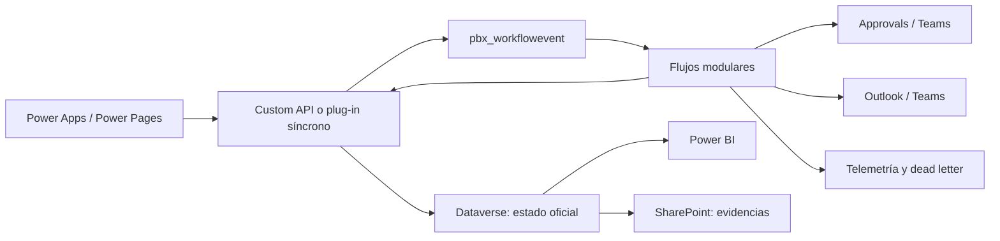

# PROpEx en Power Platform — diseño de Power Automate

## 1. Propósito y alcance

Este documento define la automatización necesaria para transferir PROpEx a Microsoft Power Platform. Power Automate se usa para trabajo asíncrono, aprobaciones humanas, avisos, recordatorios, escalaciones, integraciones y operación. Dataverse conserva el estado oficial. Las validaciones transaccionales y las reglas que no admiten duplicados o estados parciales se ejecutan mediante una Custom API o un plug-in síncrono de Dataverse.

El diseño parte del sistema vigente inspeccionado en `prisma/schema.prisma`, `src/app/actions.ts`, `src/lib/workflow.ts`, `src/lib/coins.ts`, `src/lib/kaizen-from-idea.ts`, `src/lib/kaizen-closure.ts`, `src/app/(app)/entrenamientos/actions.ts` y `src/app/(app)/probocacoins/actions.ts`.

El alcance funcional observado incluye:

- Ideas capturadas por QR, folio `IM-000001`, ruta jerárquica, supervisor, seguidores, evidencia inicial y clasificación A/B/C.
- Aprobación inicial y validaciones paralelas de Calidad, Seguridad, Mantenimiento y áreas de apoyo dinámicas.
- Solicitudes de más información, rechazo, reapertura, clasificación, asignación, implementación, evidencia final, cierre, cancelación y repositorio.
- Proyectos Kaizen con Charter, equipo, actividades, evidencias, actualización automática de estado, cierre o cancelación y reconocimiento del equipo.
- Recorridos GENBA con departamentos esperados/asistentes, actividades, evidencias, cierre/cancelación y promoción a Kaizen.
- ProbocaCoins con libro mayor, premios, ajustes, canjes, conciliaciones, retiro de reconocimiento y reverso compensatorio de duplicados.
- Entrenamientos con programas, sesiones, inscripción, asistencia, cancelación y otorgamiento de ProbocaCoins.
- Notificaciones por correo/Teams, auditoría, recordatorios y recuperación de errores.

Los nombres `pbx_*` están alineados con el publicador Proboca y el diccionario definitivo de Dataverse de esta migración.

## 2. Decisión de arquitectura



Reglas rectoras:

1. Ningún flujo se dispara directamente por cualquier modificación de una tabla maestra. Un plug-in genera un evento inmutable en `pbx_workflowevent` dentro de la misma transacción del cambio de negocio. Esto evita bucles causados por las propias actualizaciones del flujo.
2. Cada evento contiene `pbx_eventid`, `pbx_eventtype`, `pbx_entityname`, `pbx_entityid`, `pbx_entityversion`, `pbx_correlationid`, `pbx_occurredon`, `pbx_payloadversion` y sólo los datos mínimos necesarios. El flujo relee Dataverse antes de actuar.
3. Cada flujo reclama el evento mediante una fila de `pbx_flowexecution` con clave alternativa única. Si la clave ya existe como completada, finaliza como `DuplicateIgnored`.
4. Las aprobaciones de larga duración nunca usan un único flujo suspendido en “Start and wait for an approval”. Se separan creación y recepción de respuesta.
5. El envío de mensajes usa una bandeja de salida. La operación principal no se revierte porque Outlook o Teams no estén disponibles.
6. Los flujos no actualizan saldos calculados. El saldo de ProbocaCoins es la suma del libro mayor inmutable.
7. Los cambios que requieren atomicidad se realizan mediante Custom API; el flujo sólo invoca la operación y procesa el resultado `Applied`, `AlreadyProcessed`, `StaleVersion` o `BusinessRejected`.

## 3. Tablas técnicas mínimas para automatización

| Tabla lógica | Propósito | Clave alternativa obligatoria |
| --- | --- | --- |
| `pbx_workflowevent` | Evento de dominio inmutable creado en la transacción de negocio. | `pbx_eventid` |
| `pbx_flowexecution` | Idempotencia, duración, versión del flujo, intento y resultado. | `pbx_executionkey` |
| `pbx_approvalcase` | Solicitud humana independiente del conector de Approvals; conserva ronda, estado y vencimiento. | `pbx_approvalkey` |
| `pbx_approvalresponseinbox` | Respuesta cruda recibida del conector, antes de aplicarla al expediente. | `pbx_externalresponseid` |
| `pbx_notificationoutbox` | Mensaje lógico, plantilla, destinatario, canal y estado. | `pbx_notificationkey` |
| `pbx_notificationattempt` | Intentos de entrega y error sanitizado. | `pbx_attemptkey` |
| `pbx_deadletter` | Evento agotado o error permanente, con opción de reproducción controlada. | `pbx_deadletterkey` |
| `pbx_slaevent` | Registro de recordatorio/escalación ya emitido. | `pbx_slakey` |
| `pbx_auditlog` | Auditoría de negocio independiente del historial de ejecuciones. | `pbx_auditkey` |

Tablas de negocio referidas por los flujos: `pbx_idea`, `pbx_approval`, `pbx_supportrequest`, `pbx_ideafollower`, `pbx_attachment`, `pbx_kaizenproject`, `pbx_kaizenteammember`, `pbx_kaizenactivity`, `pbx_genbawalk`, `pbx_genbaactivity`, `pbx_participant`, `pbx_trainingprogram`, `pbx_trainingsession`, `pbx_trainingenrollment` y `pbx_cointransaction`.

## 4. Estándares transversales de ejecución

### 4.1 Claves de idempotencia

La clave base es:

```text
{flowCode}:{flowMajorVersion}:{eventId}
```

Claves especializadas:

- Aprobación: `{approvalCaseId}:{round}`.
- Respuesta: `{approvalCaseId}:{round}:{externalResponseId}`.
- Notificación: `{businessEventId}:{templateVersion}:{channel}:{recipientObjectId-or-hash}`.
- Recordatorio: `{entityName}:{entityId}:{dueDateUtc}:{threshold}:{recipientId}`.
- Reconocimiento: `{sourceType}:{sourceId}:{participantId}:target:{amount}:v{rewardVersion}`.
- Entrenamiento: `training:{enrollmentId}`; debe coincidir con la referencia única del libro mayor.
- Promoción GENBA: `genba-activity:{genbaActivityId}:kaizen`.

`pbx_flowexecution.pbx_executionkey` y las referencias de movimientos se implementan como claves alternativas de Dataverse; un “Get rows” previo no sustituye la restricción única.

### 4.2 Patrón de scopes y `run-after`

Todo flujo productivo usa esta estructura:

1. `Initialize`: valida esquema del evento y crea/reclama `pbx_flowexecution`.
2. `Try`: ejecuta lecturas, Custom APIs y creación de outbox.
3. `Catch`: configurado con `run-after` para `has failed`, `has timed out` y `is skipped` del scope `Try`; clasifica el error, registra intento y decide reintento o dead letter.
4. `Finally`: configurado con `run-after` para éxito, falla, timeout y skipped de `Try`/`Catch`; cierra telemetría y nunca altera el estado de negocio.
5. `Terminate`: `Succeeded` para `Applied`, `AlreadyProcessed` y `ObsoleteEvent`; `Failed` sólo para errores técnicos que deban reintentarse.

Los errores 400 de regla de negocio, 403 por mala configuración, referencia inexistente o `StaleVersion` no se reintentan ciegamente. Los 408, 429, 5xx, timeouts y bloqueos optimistas sí usan reintento limitado.

### 4.3 Perfiles operativos

| Perfil | Concurrency del trigger | Paralelismo interno | Timeout de flujo | Timeout por acción | Reintentos |
| --- | ---: | ---: | ---: | ---: | --- |
| `Q1` evento rápido | 10 | 5 | 5 min | 1 min | Dataverse: exponencial, 4; conectores: 3 |
| `Q2` estado sensible | 5 | 1 por expediente en Custom API | 5 min | 1 min | Sólo transitorios, 4; conflicto se relee una vez |
| `Q3` mensajería | 20 | 10 | 3 min | 45 s | 3; después outbox pendiente |
| `Q4` programado | 1 | 5 | 25 min | 2 min | 3 por lote; checkpoint por página |
| `Q5` integridad | 1 | 2 | 45 min | 2 min | 2; nunca corrige automáticamente |

La “concurrencia 1 por expediente” no se intenta simular con una variable de flujo. La Custom API toma la versión de fila, hace el `claim` atómico y confirma o devuelve `StaleVersion`.

### 4.4 Propiedad, conexiones y continuidad

| Código | Propietario primario | Uso |
| --- | --- | --- |
| `SVC-ORCH` | `svc-propex-orchestration` | Eventos de dominio y Custom APIs. |
| `SVC-APR` | `svc-propex-approvals` | Approvals y tarjetas de Teams. |
| `SVC-NOT` | `svc-propex-notifications` | Outlook y Teams. |
| `SVC-OPS` | `svc-propex-operations` | Monitores, conciliación, alertas y reportes de salud. |

Los identificadores reales se configuran como variables de entorno. Las cuentas no son cuentas personales; se les aplica MFA/Conditional Access compatible con automatización, licencia mínima necesaria, buzón funcional y revisión trimestral. Cada flujo tiene como copropietario al grupo Entra `PROpEx-PowerPlatform-Admins`. Dataverse utiliza application user/service principal cuando el conector lo permita. Las conexiones se exponen mediante connection references de la solución, no se incrustan en acciones.

### 4.5 DLP

| Perfil DLP | Conectores permitidos en grupo Business | Prohibiciones |
| --- | --- | --- |
| `DLP-BUS` | Dataverse, Approvals, Microsoft Teams, Office 365 Outlook, SharePoint, Office 365 Users. | Conectores personales, redes sociales, almacenamiento de consumo y HTTP genérico. |
| `DLP-OPS` | Dataverse, Teams/Outlook operativos, Power Platform for Admins y el conector personalizado `PROpEx Dataverse API`. | Exportación a destinos no administrados; secretos en texto; HTTP público. |

El conector personalizado sólo expone las Custom APIs permitidas, autentica con Entra ID y limita endpoints/hosts. Los archivos se almacenan en SharePoint administrado; los eventos llevan referencias, no contenido binario ni datos personales innecesarios.

## 5. Catálogo de flujos compartidos

### `FND-01 — Dispatch Notification Outbox` — obligatorio

- **Disparador/condición:** fila agregada o cambiada en `pbx_notificationoutbox`; filtro `status = Pending`, `nextattempton <= utcNow()` y `suppressed = false`.
- **Acciones/estados:** reclama `Pending → Sending`; valida consentimiento/destinatario; llama a `FND-02`; actualiza `Sent` o vuelve a `Pending` con próximo intento. No toca el expediente.
- **Tablas:** outbox, attempts, flowexecution; lectura de usuario/participante sólo para resolver idioma/canal.
- **Idempotencia:** `FND01:2:{notificationkey}`. Una restricción única impide dos outbox equivalentes.
- **Operación:** `Q3`, propietario `SVC-NOT`, `DLP-BUS`.
- **Timeout/run-after:** 3 min/45 s; `Catch` registra el error sanitizado. En el tercer fallo técnico marca `Exhausted` y crea dead letter.
- **Pruebas:** `T-FND01-A` mismo mensaje creado dos veces produce una entrega; `T-FND01-B` destinatario vacío queda `Suppressed`; `T-FND01-C` 429 reintenta sin duplicar.

### `FND-02 — Deliver One Notification` — obligatorio, child flow

- **Disparador/condición:** ejecución hija desde `FND-01` con `notificationId`, canal y `correlationId`; sólo acepta una fila en `Sending` reclamada por el padre.
- **Acciones/estados:** carga plantilla versionada; sustituye campos permitidos; envía por Outlook o Teams; registra `providerMessageId` y `pbx_notificationattempt`.
- **Tablas:** notificationoutbox, notificationattempt, setting/template; sin escritura a tablas maestras.
- **Idempotencia:** `{notificationkey}:{attemptNumber}` y `providerMessageId` cuando el conector lo devuelve.
- **Operación:** `Q3`, propietario `SVC-NOT`, `DLP-BUS`.
- **Timeout/run-after:** 2 min/45 s; no reintenta 400/403; `Catch` devuelve una salida tipada al padre, no crea bucles.
- **Pruebas:** `T-FND02-A` plantilla con marcador no permitido se rechaza; `T-FND02-B` caída de Teams no impide correo si son dos outbox distintos; `T-FND02-C` no expone detalles sensibles en el asunto.

### `FND-03 — Retry Notification Scheduler` — obligatorio

- **Disparador/condición:** recurrencia cada 15 min; mensajes `Pending` cuyo `nextattempton` venció y `attemptcount < 3`.
- **Acciones/estados:** procesa páginas de 100, cambia `nextattempton`, vuelve a invocar la entrega mediante actualización controlada y conserva checkpoint.
- **Tablas:** notificationoutbox, notificationattempt, flowexecution.
- **Idempotencia:** `FND03:{notificationId}:{attemptNumber}`.
- **Operación:** `Q4`, propietario `SVC-NOT`, `DLP-BUS`.
- **Timeout/run-after:** 25 min/2 min; un mensaje fallido no cancela el lote; `Catch` por elemento y `Finally` con conteos.
- **Pruebas:** `T-FND03-A` respeta máximo de intentos; `T-FND03-B` reanuda después de una página fallida; `T-FND03-C` no toma filas futuras.

### `FND-04 — Dead Letter Alert and Replay` — obligatorio

- **Disparador/condición:** fila `pbx_deadletter` agregada con `status = New`, o cambio administrativo a `ReplayApproved`.
- **Acciones/estados:** para `New`, avisa al grupo de soporte con correlation ID y liga; para `ReplayApproved`, crea un nuevo evento con `causationEventId`, incrementa `replayNumber` y marca `Replayed`. Nunca edita el evento original.
- **Tablas:** deadletter, workflowevent, flowexecution, auditlog, notificationoutbox.
- **Idempotencia:** `deadletterId:replayNumber`; sólo un replay aprobado por número.
- **Operación:** `Q2`, propietario `SVC-OPS`, `DLP-OPS`.
- **Timeout/run-after:** 5 min/1 min; si la alerta falla queda visible en la vista operativa. Un replay con causa aún vigente no se repite automáticamente.
- **Pruebas:** `T-FND04-A` sólo administradores pueden aprobar replay; `T-FND04-B` doble clic crea un evento; `T-FND04-C` conserva payload y relación causal.

### `FND-05 — Daily Automation Health` — recomendado

- **Disparador/condición:** diario 06:00 `America/Mexico_City` convertido a UTC; siempre.
- **Acciones/estados:** agrega ejecuciones fallidas, colas envejecidas, aprobaciones sin identificador externo, dead letters abiertos y connection references inválidas; genera resumen sin datos sensibles.
- **Tablas:** flowexecution, outbox, approvalcase, deadletter; lectura de metadatos administrativos.
- **Idempotencia:** `health:{yyyy-MM-dd}:v1`.
- **Operación:** `Q5`, propietario `SVC-OPS`, `DLP-OPS`.
- **Timeout/run-after:** 45 min/2 min; las consultas son independientes con `run-after` para continuar ante una fuente fallida.
- **Pruebas:** `T-FND05-A` día sano produce cero alertas; `T-FND05-B` detecta cola >30 min; `T-FND05-C` el cambio de horario no duplica informe.

## 6. Ideas, aprobaciones y apoyos

Estados vigentes que se deben mapear: `EN_REVISION_SUPERVISOR`, `RECHAZADA_SUPERVISOR`, `SOLICITUD_INFORMACION`, `APROBADA_SUPERVISOR`, `EN_VALIDACION_CALIDAD`, `EN_VALIDACION_SEGURIDAD`, `EN_VALIDACION_MANTENIMIENTO`, `RECHAZADA_VALIDACION`, `APROBADA_PARA_IMPLEMENTAR`, `CLASIFICACION_MEJORA_CONTINUA`, `EN_IMPLEMENTACION`, `IMPLEMENTADA`, `EN_VALIDACION_FINAL`, `CERRADA`, `CANCELADA` y `VENCIDA`.

En la solución nueva se recomienda mantener la etapa de negocio y el SLA por separado. `VENCIDA` no debe borrar la etapa anterior; usar `pbx_slastatus = Overdue`, `pbx_overdueon` y `pbx_stagebeforeoverdue`. El valor legado `VENCIDA` se conserva sólo para migración/reportes si se necesita paridad histórica.

### `IDEA-01 — Intake Acknowledgement and Routing` — obligatorio

- **Disparador/condición:** `pbx_workflowevent` tipo `Idea.Created`; la idea existe, está `EN_REVISION_SUPERVISOR` y tiene supervisor activo resuelto por la regla jerárquica.
- **Acciones/estados:** relee área, participante, supervisor, seguidores y evidencia inicial; crea outbox de acuse al colaborador, aviso al supervisor y avisos de seguimiento; si falta responsable crea incidencia de configuración y bloquea la idea con `pbx_routingstatus = ConfigurationError` mediante Custom API.
- **Tablas:** idea, participant, orgunit, escalationrule, membership, ideafollower, attachment, notificationoutbox, auditlog.
- **Idempotencia:** `IDEA01:2:{eventId}`; notificaciones separadas por destinatario/plantilla.
- **Operación:** `Q1`, propietario `SVC-ORCH`, `DLP-BUS`.
- **Timeout/run-after:** 5 min/1 min; una notificación fallida queda en outbox y no revierte el alta.
- **Pruebas:** `T-IDEA01-A` doble envío conserva un folio y un set de avisos; `T-IDEA01-B` ruta específica prevalece sobre supervisor de área; `T-IDEA01-C` supervisor inactivo crea incidencia sin reasignación silenciosa; `T-IDEA01-D` captura sin correo no intenta enviar al colaborador.

### `IDEA-02 — Start Human Approval` — obligatorio

- **Disparador/condición:** evento `ApprovalCase.Ready`; caso `PendingDispatch`, asignado, ronda vigente y tipo `SUPERVISOR`, `CALIDAD`, `SEGURIDAD`, `MANTENIMIENTO` o `APOYO_DINAMICO`.
- **Acciones/estados:** crea la aprobación o Adaptive Card; guarda `externalApprovalId`; cambia `PendingDispatch → AwaitingResponse`; crea notificación alternativa con liga a Power Apps. El flujo termina inmediatamente.
- **Tablas:** approvalcase, approval/supportrequest, idea, orgunit, user, notificationoutbox.
- **Idempotencia:** `{approvalCaseId}:{round}` como `pbx_approvalkey`; si ya existe `externalApprovalId`, no crea otro.
- **Operación:** `Q2`, propietario `SVC-APR`, `DLP-BUS`.
- **Timeout/run-after:** 5 min/1 min para creación; no hay espera de días. Si el conector falla, deja `DispatchFailed` y dead letter tras 3 intentos.
- **Pruebas:** `T-IDEA02-A` replay no duplica tarjeta; `T-IDEA02-B` un caso reasignado genera nueva ronda y cancela la anterior; `T-IDEA02-C` aprobación pendiente 45 días no mantiene ejecución suspendida; `T-IDEA02-D` apoyo dinámico muestra el nombre del área solicitada.

### `IDEA-03 — Receive and Apply Approval Response` — obligatorio

- **Disparador/condición:** respuesta del conector o webhook interno agregada a `pbx_approvalresponseinbox`; sólo ronda vigente y respondente autorizado.
- **Acciones/estados:** normaliza `Aprobar`, `Rechazar` o `Solicitar información`; exige comentarios para rechazo/más información; llama a `pbx_ApplyApprovalResponse`; guarda `Applied`, `Duplicate`, `StaleRound` o `Unauthorized`; genera evento de respuesta aplicada.
- **Tablas:** approvalresponseinbox, approvalcase, approval, supportrequest, idea, auditlog.
- **Idempotencia:** `{approvalCaseId}:{round}:{externalResponseId}`; la Custom API también reclama `(case, round)` una sola vez.
- **Operación:** `Q2`, propietario `SVC-APR`, `DLP-BUS`.
- **Timeout/run-after:** 5 min/1 min; `StaleRound` termina con éxito técnico y auditoría; 403 se envía a operación, no se reintenta.
- **Pruebas:** `T-IDEA03-A` dos respuestas simultáneas aplican una; `T-IDEA03-B` rechazo sin comentario se rechaza como regla de negocio; `T-IDEA03-C` jefe distinto no puede responder; `T-IDEA03-D` respuesta de ronda anterior no modifica la idea.

### `IDEA-04 — Recompute Validation Gate` — obligatorio

- **Disparador/condición:** evento `Idea.ApprovalApplied` o `Idea.SupportResponseApplied`; la idea no está terminal.
- **Acciones/estados:** llama a `pbx_RecomputeIdeaGate`. La API evalúa todas las aprobaciones estándar y apoyos activados: cualquier `Rejected → RECHAZADA_VALIDACION`; cualquier `MoreInfo → SOLICITUD_INFORMACION`; pendientes estándar → estado de la siguiente validación; sólo apoyo dinámico pendiente → `APROBADA_SUPERVISOR`; ninguno pendiente → `APROBADA_PARA_IMPLEMENTAR`. El flujo crea avisos de la transición confirmada.
- **Tablas:** idea, approval, supportrequest, notificationoutbox, auditlog.
- **Idempotencia:** `IDEA04:2:{ideaId}:{approvalSetVersion}`.
- **Operación:** `Q2`, propietario `SVC-ORCH`, `DLP-BUS`.
- **Timeout/run-after:** 5 min/1 min; conflicto de versión relee una vez; nunca calcula el gate con datos incluidos en el evento.
- **Pruebas:** `T-IDEA04-A` Calidad y Seguridad responden a la vez sin saltarse Mantenimiento; `T-IDEA04-B` un rechazo prevalece sobre aprobaciones; `T-IDEA04-C` más información prevalece mientras no haya rechazo; `T-IDEA04-D` sin validaciones requeridas pasa a implementar; `T-IDEA04-E` un apoyo dinámico pendiente impide liberar.

### `IDEA-05 — More Information Submitted or Reopened` — obligatorio

- **Disparador/condición:** evento `Idea.InformationSubmitted` o `Idea.ReopenAuthorized`; usuario y estado autorizados por Custom API.
- **Acciones/estados:** crea nueva ronda sólo para los casos `MORE_INFO` o el rechazo explícitamente reabierto; conserva respuestas históricas; genera casos nuevos `PendingDispatch`; avisa a revisores. No borra registros de aprobación anteriores.
- **Tablas:** idea, approvalcase, approval, supportrequest, comment, attachment, auditlog, notificationoutbox.
- **Idempotencia:** `IDEA05:2:{ideaId}:{reopenVersion}`.
- **Operación:** `Q2`, propietario `SVC-ORCH`, `DLP-BUS`.
- **Timeout/run-after:** 5 min/1 min; si no puede crear todos los casos, la Custom API revierte la ronda completa.
- **Pruebas:** `T-IDEA05-A` nueva evidencia abre una sola ronda; `T-IDEA05-B` aprobaciones no afectadas permanecen aprobadas; `T-IDEA05-C` idea cerrada no se reabre por este evento; `T-IDEA05-D` reapertura conserva motivo e historial.

### `IDEA-06 — Classification and Assignment Events` — obligatorio

- **Disparador/condición:** eventos `Idea.Classified` y `Idea.ImplementationAssigned`; clasificación/propietario/fecha ya confirmados en Dataverse.
- **Acciones/estados:** avisa a Mejora Continua y responsable; si la clasificación es `KAIZEN`, invoca `pbx_CreateOrSyncKaizenFromIdea`, que usa `sourceIdeaId` único, crea líder/equipo y devuelve el folio; genera el evento `Kaizen.CreatedFromIdea`.
- **Tablas:** idea, kaizenproject, kaizenteammember, user, notificationoutbox, auditlog.
- **Idempotencia:** para la idea `{ideaId}:classification:{classificationVersion}`; para Kaizen `sourceIdeaId` como clave única.
- **Operación:** `Q2`, propietario `SVC-ORCH`, `DLP-BUS`.
- **Timeout/run-after:** 5 min/1 min; si la creación de Kaizen falla, la idea conserva clasificación y queda `pbx_kaizensyncstatus = Failed` para replay.
- **Pruebas:** `T-IDEA06-A` clasificar dos veces como Kaizen produce un proyecto; `T-IDEA06-B` actualizar líder sincroniza el miembro anterior sin perder historia; `T-IDEA06-C` clasificación no Kaizen no crea proyecto; `T-IDEA06-D` fecha final anterior a inicio se normaliza a 30 días por la API.

### `IDEA-07 — Implementation and Final Review Notifications` — obligatorio

- **Disparador/condición:** eventos `Idea.ImplementationUpdated`, `Idea.Implemented` o `Idea.FinalReviewRequested`; sólo transición confirmada y responsable vigente.
- **Acciones/estados:** notifica avance/retraso; al declarar implementación valida que el expediente pase a `IMPLEMENTADA` o `EN_VALIDACION_FINAL`; crea solicitud final para Mejora Continua cuando corresponda; nunca valida evidencia dentro del flujo.
- **Tablas:** idea, attachment, approvalcase, approval, user, notificationoutbox, auditlog.
- **Idempotencia:** `IDEA07:2:{ideaId}:{implementationVersion}`.
- **Operación:** `Q1`, propietario `SVC-ORCH`, `DLP-BUS`.
- **Timeout/run-after:** 5 min/1 min; un archivo inaccesible genera incidencia, no se copia por el evento.
- **Pruebas:** `T-IDEA07-A` avance repetido no duplica aviso; `T-IDEA07-B` evidencia requerida ausente impide solicitud final en la Custom API; `T-IDEA07-C` cambio de responsable notifica al nuevo y no concede permisos por correo.

### `IDEA-08 — Closure and Recognition Notification` — obligatorio

- **Disparador/condición:** evento `Idea.Closed` o `Idea.RewardReconciled` emitido después de la transacción de cierre/recompensa.
- **Acciones/estados:** relee puntos y movimientos confirmados; avisa a colaborador, supervisor, validadores, seguidores y Mejora Continua; diferencia cierre inicial de ajuste posterior; publica mensaje de reconocimiento opcional sin exponer ahorro confidencial.
- **Tablas:** idea, ideapointrule, cointransaction, participant, approval, ideafollower, notificationoutbox.
- **Idempotencia:** `IDEA08:2:{ideaId}:{rewardVersion}:{eventType}`.
- **Operación:** `Q1`, propietario `SVC-NOT`, `DLP-BUS`.
- **Timeout/run-after:** 5 min/45 s; fallas de canal permanecen en outbox sin deshacer el cierre.
- **Pruebas:** `T-IDEA08-A` cierre otorga una notificación por destinatario; `T-IDEA08-B` ajuste de 100 a 80 comunica el saldo objetivo; `T-IDEA08-C` participante sin correo no bloquea; `T-IDEA08-D` replay no vuelve a otorgar monedas.

### `IDEA-09 — Cancellation or Administrative Reopen Events` — obligatorio

- **Disparador/condición:** eventos `Idea.Cancelled`, `Idea.ReopenAuthorized` o `Idea.RewardRemoved`, todos originados por Custom API con motivo obligatorio y rol autorizado.
- **Acciones/estados:** cancela aprobaciones externas aún abiertas, crea avisos y tareas de seguimiento; en retiro de puntos comunica el movimiento compensatorio ya confirmado. No elimina físicamente expedientes.
- **Tablas:** idea, approvalcase, approval, cointransaction, comment, auditlog, notificationoutbox.
- **Idempotencia:** `IDEA09:2:{ideaId}:{administrativeActionVersion}`.
- **Operación:** `Q2`, propietario `SVC-ORCH`, `DLP-BUS`.
- **Timeout/run-after:** 5 min/1 min; fallo al cancelar una tarjeta externa se registra como advertencia, porque Dataverse ya es la fuente oficial.
- **Pruebas:** `T-IDEA09-A` cancelación requiere motivo; `T-IDEA09-B` respuesta tardía a aprobación cancelada queda obsoleta; `T-IDEA09-C` retiro de puntos crea ajuste, no borra transacción; `T-IDEA09-D` expediente histórico no se elimina.

### `IDEA-10 — Idea and Approval SLA Reminder` — obligatorio

- **Disparador/condición:** recurrencia diaria 06:45 local; ideas no terminales, aprobaciones/casos humanos pendientes y fechas compromiso a 7, 3, 1 o 0 días, o vencidas 1, 3, 7 y 14 días. Para revisión sin `dueDate`, usa la fecha objetivo de la política SLA versionada por etapa.
- **Acciones/estados:** crea `pbx_slaevent`; recuerda al supervisor, validador, apoyo o responsable; escala por jerarquía y a Mejora Continua según umbral; llama a la API de SLA para actualizar `pbx_slastatus/pbx_overdueon` sin reemplazar la etapa de negocio. Cancela o invalida la aprobación externa sólo cuando la política ordene una reasignación explícita.
- **Tablas:** idea, approvalcase, approval, supportrequest, user, membership/escalationrule, slaevent, notificationoutbox, auditlog.
- **Idempotencia:** `{ideaId}:{stage}:{stageVersion}:{dueDateUtc}:{threshold}:{recipientId}`; para casos humanos incluye `{approvalCaseId}:{round}`.
- **Operación:** `Q4`, propietario `SVC-OPS`, `DLP-BUS`.
- **Timeout/run-after:** 25 min/2 min; páginas de 100, concurrencia 5 y checkpoint; un destinatario inválido crea incidencia sin detener el lote.
- **Pruebas:** `T-IDEA10-A` no avisa ideas cerradas/canceladas/rechazadas; `T-IDEA10-B` no reemplaza `EN_IMPLEMENTACION` por `VENCIDA`; `T-IDEA10-C` cambio de fecha o etapa inicia una serie nueva; `T-IDEA10-D` una aprobación de más de 30 días sigue siendo recuperable; `T-IDEA10-E` reasignación invalida la ronda anterior y no acepta su respuesta tardía.

## 7. Kaizen

Estados: `PENDIENTE_CHARTER`, `PLANIFICACION`, `EN_CURSO`, `EN_PAUSA`, `COMPLETADO`, `CANCELADO`. Actividades: `PENDIENTE`, `EN_PROCESO`, `BLOQUEADA`, `COMPLETADA`, `CANCELADA`, `COMBINADA`.

### `KZN-01 — Project, Team and Activity Assignment` — obligatorio

- **Disparador/condición:** eventos `Kaizen.Created`, `Kaizen.CreatedFromIdea`, `Kaizen.TeamChanged`, `Kaizen.ActivityAssigned` o `Kaizen.ActivityReassigned`; proyecto no terminal.
- **Acciones/estados:** avisa líder/equipo/responsable con vínculo al expediente, Charter requerido y fechas; agrupa actividades de un mismo evento para no enviar un correo por fila; no agrega miembros ni cambia estado directamente.
- **Tablas:** kaizenproject, kaizenteammember, kaizenactivity, user, notificationoutbox, auditlog.
- **Idempotencia:** `KZN01:2:{eventId}` y notificación `{projectId}:{activityId}:{assignmentVersion}:{recipient}`.
- **Operación:** `Q1`, propietario `SVC-ORCH`, `DLP-BUS`.
- **Timeout/run-after:** 5 min/1 min; destinatario inactivo genera incidencia de asignación.
- **Pruebas:** `T-KZN01-A` proyecto desde idea conserva un `sourceIdeaId`; `T-KZN01-B` líder recibe un solo aviso; `T-KZN01-C` reasignación avisa sólo al nuevo responsable; `T-KZN01-D` usuario inactivo no se sustituye silenciosamente.

### `KZN-02 — Kaizen SLA Reminder and Escalation` — obligatorio

- **Disparador/condición:** recurrencia diaria 07:00 local; proyectos activos y actividades no terminales con fecha a 7, 3, 1 o 0 días, o vencidas 1, 3, 7, 14 días.
- **Acciones/estados:** crea `pbx_slaevent`, notifica responsable/líder; a partir de 3 días vencidos incluye Mejora Continua; a partir de 7 incluye patrocinador o superior configurado. Calcula SLA, pero no sobrescribe el estado de actividad.
- **Tablas:** kaizenproject, kaizenactivity, kaizenteammember, membership/escalationrule, slaevent, notificationoutbox.
- **Idempotencia:** `{activityId}:{dueDateUtc}:{threshold}:{recipientId}`.
- **Operación:** `Q4`, propietario `SVC-OPS`, `DLP-BUS`.
- **Timeout/run-after:** 25 min/2 min; páginas de 100 y concurrencia 5; checkpoint por última clave.
- **Pruebas:** `T-KZN02-A` no avisa actividades combinadas/cerradas; `T-KZN02-B` cambio de fecha permite nueva serie sin repetir la anterior; `T-KZN02-C` fin de semana usa calendario configurado; `T-KZN02-D` zona horaria no adelanta un día.

### `KZN-03 — Closure, Cancellation and Rewards` — obligatorio

- **Disparador/condición:** eventos `Kaizen.Closed`, `Kaizen.Cancelled` o `Kaizen.RewardReconciled` emitidos después de `pbx_CloseKaizen`/`pbx_ReconcileKaizenRewards`.
- **Acciones/estados:** notifica resultado, equipo y recompensas confirmadas; si nació de una idea, comunica la transición ya aplicada a `IMPLEMENTADA`; actualiza tarjetas externas abiertas como sólo lectura.
- **Tablas:** kaizenproject, kaizenactivity, attachment, kaizenteammember, cointransaction, idea, notificationoutbox.
- **Idempotencia:** `KZN03:2:{projectId}:{closureVersion}:{rewardVersion}`.
- **Operación:** `Q1`, propietario `SVC-NOT`, `DLP-BUS`.
- **Timeout/run-after:** 5 min/1 min; fallo de aviso no deshace el cierre/recompensa.
- **Pruebas:** `T-KZN03-A` no se completa sin Charter, equipo, resultado, actividades resueltas y evidencia en cada completada; `T-KZN03-B` cancelar exige nota y cancela pendientes en una transacción; `T-KZN03-C` cada miembro recibe el importe correcto; `T-KZN03-D` ajuste posterior concilia al objetivo sin segundo premio completo.

## 8. GENBA

Estados de recorrido: `ABIERTO`, `CERRADO`, `CANCELADO`. Las actividades usan los mismos estados de trabajo que Kaizen.

### `GEN-01 — Walk and Activity Assignment` — obligatorio

- **Disparador/condición:** eventos `Genba.Created`, `Genba.ActivityAssigned` o `Genba.ActivityReassigned`; recorrido abierto.
- **Acciones/estados:** agrupa actividades por responsable; notifica área, fecha, problemas, acciones y vencimientos; avisa al coordinador si hay actividades sin responsable.
- **Tablas:** genbawalk, genbaactivity, user, orgunit, notificationoutbox, auditlog.
- **Idempotencia:** `GEN01:2:{eventId}` y `{walkId}:{assignmentVersion}:{recipient}`.
- **Operación:** `Q1`, propietario `SVC-ORCH`, `DLP-BUS`.
- **Timeout/run-after:** 5 min/1 min; actividades sin correo quedan en una vista operativa.
- **Pruebas:** `T-GEN01-A` cinco actividades del mismo dueño generan un resumen; `T-GEN01-B` departamentos asistentes son subconjunto de esperados; `T-GEN01-C` recorrido sin responsables avisa al coordinador; `T-GEN01-D` replay no repite mensajes.

### `GEN-02 — GENBA SLA Reminder and Escalation` — obligatorio

- **Disparador/condición:** recurrencia diaria 07:15 local; recorridos abiertos y actividades no terminales, con los mismos umbrales 7/3/1/0 y vencidas 1/3/7/14.
- **Acciones/estados:** crea SLA event; notifica responsable y coordinador; escala a Mejora Continua según antigüedad. No cambia `ABIERTO` ni estado de actividad.
- **Tablas:** genbawalk, genbaactivity, membership/escalationrule, slaevent, notificationoutbox.
- **Idempotencia:** `{genbaActivityId}:{dueDateUtc}:{threshold}:{recipientId}`.
- **Operación:** `Q4`, propietario `SVC-OPS`, `DLP-BUS`.
- **Timeout/run-after:** 25 min/2 min; fallo individual no detiene el lote.
- **Pruebas:** `T-GEN02-A` omite completadas/canceladas/combinadas; `T-GEN02-B` recorrido cancelado no envía; `T-GEN02-C` cambio de dueño dirige futuros avisos al nuevo; `T-GEN02-D` no duplica el mismo umbral.

### `GEN-03 — Walk Closure or Cancellation Event` — obligatorio

- **Disparador/condición:** eventos `Genba.Closed` o `Genba.Cancelled` confirmados por Custom API.
- **Acciones/estados:** notifica coordinador y Mejora Continua; resume asistencia, actividades completadas/canceladas y evidencias; cancela tarjetas externas de actividades aún abiertas sólo en el caso administrativo permitido.
- **Tablas:** genbawalk, genbaactivity, attachment, update/auditlog, notificationoutbox.
- **Idempotencia:** `GEN03:2:{walkId}:{closureVersion}`.
- **Operación:** `Q1`, propietario `SVC-NOT`, `DLP-BUS`.
- **Timeout/run-after:** 5 min/1 min; las métricas se releen después del cierre.
- **Pruebas:** `T-GEN03-A` cierre exige todas las actividades resueltas; `T-GEN03-B` completar la última actividad puede cerrar una vez; `T-GEN03-C` cancelación exige motivo y cancela pendientes; `T-GEN03-D` fallo de Teams no reabre recorrido.

### `GEN-04 — Promote GENBA Activity to Kaizen` — obligatorio

- **Disparador/condición:** evento `Genba.PromotionRequested`; actividad no promovida y actor con rol autorizado.
- **Acciones/estados:** llama a `pbx_PromoteGenbaActivityToKaizen`; la API enlaza a proyecto existente o crea uno, crea actividad Kaizen, agrega al responsable al equipo y fija `sourceGenbaActivityId`; el flujo emite avisos y actualizaciones cruzadas.
- **Tablas:** genbaactivity, genbawalk, kaizenproject, kaizenactivity, kaizenteammember, auditlog, notificationoutbox.
- **Idempotencia:** `sourceGenbaActivityId` único y `genba-activity:{id}:kaizen`.
- **Operación:** `Q2`, propietario `SVC-ORCH`, `DLP-BUS`.
- **Timeout/run-after:** 5 min/1 min; si el proyecto destino cerró entre solicitud y ejecución, devuelve `BusinessRejected` y no crea actividad huérfana.
- **Pruebas:** `T-GEN04-A` doble promoción crea una actividad; `T-GEN04-B` proyecto nuevo recibe líder y fechas válidas; `T-GEN04-C` proyecto existente conserva numeración única; `T-GEN04-D` destino terminal no se modifica.

## 9. ProbocaCoins

### `COIN-01 — Ledger Transaction Receipt` — obligatorio

- **Disparador/condición:** evento `Coin.TransactionPosted` emitido después de una transacción `AWARD`, `ADJUSTMENT` o `REDEMPTION`; participante vigente.
- **Acciones/estados:** relee movimiento y saldo agregado; notifica al participante cuando tenga canal; crea aviso administrativo para correcciones/reversos; actualiza sólo proyecciones no autoritativas de Power BI si se requieren.
- **Tablas:** cointransaction, participant, user, notificationoutbox, auditlog.
- **Idempotencia:** `COIN01:2:{coinTransactionId}`; `pbx_cointransaction.reference` es única.
- **Operación:** `Q1`, propietario `SVC-NOT`, `DLP-BUS`.
- **Timeout/run-after:** 5 min/1 min; no recalcula ni escribe saldo.
- **Pruebas:** `T-COIN01-A` premio muestra saldo posterior confirmado; `T-COIN01-B` canje insuficiente nunca produce evento porque la API lo rechaza; `T-COIN01-C` reverso identifica el movimiento original; `T-COIN01-D` replay no publica otro movimiento.

### `COIN-02 — Financial Integrity Monitor` — obligatorio

- **Disparador/condición:** recurrencia nocturna 02:00 local y ejecución manual de sólo lectura.
- **Acciones/estados:** detecta referencias duplicadas, reversos sin original, más de un reverso, premios de fuente sin entidad, recompensa de idea/Kaizen distinta al objetivo autorizado, `coinsAwarded` de entrenamiento sin asiento, movimientos cero, participante inexistente y saldos negativos no permitidos. Crea incidencias; jamás ajusta automáticamente.
- **Tablas:** cointransaction, participant, idea, kaizenteammember, trainingenrollment, deadletter/incidence, auditlog.
- **Idempotencia:** `integrity:{ruleCode}:{entityId}:{dataVersion}`; cierra la incidencia cuando el siguiente corte confirma corrección.
- **Operación:** `Q5`, propietario `SVC-OPS`, `DLP-OPS`.
- **Timeout/run-after:** 45 min/2 min; reglas en scopes paralelos de máximo 2 y resultados parciales visibles.
- **Pruebas:** `T-COIN02-A` detecta inscripción completada sin premio; `T-COIN02-B` un ajuste compensatorio válido no se marca duplicado; `T-COIN02-C` sólo alerta saldo negativo si la política lo prohíbe; `T-COIN02-D` no realiza escrituras financieras.

### `COIN-03 — Manual Movement and Reversal Event` — recomendado

- **Disparador/condición:** eventos `Coin.ManualPosted` o `Coin.DuplicateReversed`, siempre posteriores a las Custom APIs financieras y con motivo/actor autorizado.
- **Acciones/estados:** informa a Finanzas/Mejora Continua, adjunta liga al libro mayor, marca la solicitud de operación como completada y conserva motivo de corrección.
- **Tablas:** cointransaction, participant, auditlog, notificationoutbox; solicitud de operación si se usa patrón command.
- **Idempotencia:** request ID proporcionado por la app; reverso `reversalOfId` único.
- **Operación:** `Q1`, propietario `SVC-NOT`, `DLP-BUS`.
- **Timeout/run-after:** 5 min/1 min; una notificación fallida no vuelve a ejecutar la Custom API.
- **Pruebas:** `T-COIN03-A` doble clic con mismo request ID crea un movimiento; `T-COIN03-B` premio manual ligado a fuente no se duplica; `T-COIN03-C` una transacción sólo se revierte una vez; `T-COIN03-D` reverso es compensatorio y conserva original.

## 10. Entrenamientos

### `TRN-01 — Session Notice and Reminder` — recomendado

- **Disparador/condición:** eventos `Training.SessionCreated`/`Training.EnrollmentRegistered` y recurrencia diaria para sesiones a 7/1 días; programa, sesión y participante activos.
- **Acciones/estados:** notifica sesión, entrenador, planta/área y fecha; recuerda sólo inscripciones `REGISTERED`; agrupa por sesión cuando sea apropiado.
- **Tablas:** trainingprogram, trainingsession, trainingenrollment, participant, orgunit, notificationoutbox, slaevent.
- **Idempotencia:** `{sessionId}:{enrollmentId}:{noticeType}:{sessionDateUtc}`.
- **Operación:** evento `Q1`, recordatorio `Q4`; propietario `SVC-NOT`, `DLP-BUS`.
- **Timeout/run-after:** 5 o 25 min según disparador; fallas por participante no detienen el lote.
- **Pruebas:** `T-TRN01-A` inscripción cancelada no recibe recordatorio; `T-TRN01-B` cambio de fecha habilita aviso actualizado; `T-TRN01-C` participante sin correo queda suprimido; `T-TRN01-D` zona horaria conserva fecha de sesión.

### `TRN-02 — Completion, Cancellation and Reward Receipt` — obligatorio

- **Disparador/condición:** eventos `Training.EnrollmentCompleted` o `Training.EnrollmentCancelled` emitidos después de `pbx_CompleteTrainingEnrollment`/`pbx_CancelTrainingEnrollment`.
- **Acciones/estados:** para completado, confirma que existe la referencia `training:{enrollmentId}` y comunica las monedas otorgadas; para cancelado, comunica estado sólo si la política lo requiere. No crea el premio en el flujo.
- **Tablas:** trainingenrollment, trainingsession, trainingprogram, participant, cointransaction, notificationoutbox.
- **Idempotencia:** `TRN02:2:{enrollmentId}:{statusVersion}`; referencia financiera única `training:{enrollmentId}`.
- **Operación:** `Q1`, propietario `SVC-NOT`, `DLP-BUS`.
- **Timeout/run-after:** 5 min/1 min; si el evento dice completado y falta el asiento, crea incidencia crítica y no inventa el movimiento.
- **Pruebas:** `T-TRN02-A` completar individual/bulk produce un premio por inscripción; `T-TRN02-B` repetir completado conserva importe original; `T-TRN02-C` completado no se cancela sin operación compensatoria autorizada; `T-TRN02-D` conflicto concurrente se resuelve por la clave única.

### `TRN-03 — Pending Attendance Follow-up` — recomendado

- **Disparador/condición:** diario 09:00 local; sesiones cuya fecha terminó y tienen inscripciones `REGISTERED` después de 1 y 3 días.
- **Acciones/estados:** recuerda al creador/Mejora Continua capturar completado o cancelado; a los 7 días abre incidencia operativa. No presume asistencia ni otorga monedas.
- **Tablas:** trainingsession, trainingenrollment, user, slaevent, notificationoutbox, incidence/deadletter.
- **Idempotencia:** `{sessionId}:pending-attendance:{threshold}`.
- **Operación:** `Q4`, propietario `SVC-OPS`, `DLP-BUS`.
- **Timeout/run-after:** 25 min/2 min; una sesión fallida no detiene otras.
- **Pruebas:** `T-TRN03-A` sesión totalmente resuelta no aparece; `T-TRN03-B` umbral se envía una vez; `T-TRN03-C` completar después del aviso cierra incidencia; `T-TRN03-D` no altera asistencia.

## 11. Reglas que no deben vivir en Power Automate

| Regla | Ubicación correcta | Motivo |
| --- | --- | --- |
| Generación de folios únicos `IM-*`, `KZN-*`, `GENBA-*`. | Autonumber de Dataverse o Custom API con clave única. | Un `max + 1` en un flujo falla bajo concurrencia. |
| Matriz de transiciones de Ideas, Kaizen, GENBA y actividades. | Custom API/plug-in y columnas de estado de Dataverse. | Debe validarse en cada canal y en una transacción. |
| Seguridad por rol, planta, unidad, jerarquía y propiedad. | Security roles, teams, business units, column security y plug-in. | Ocultar una acción o filtrar un flujo no es autorización. |
| Selección del supervisor y área de apoyo válida. | Datos organizacionales + Custom API de enrutamiento. | Debe ser determinista, auditable y aplicarse antes de confirmar el alta. |
| Cálculo del gate de aprobaciones y precedencia rechazo/más información. | `pbx_RecomputeIdeaGate` en Dataverse. | Respuestas paralelas pueden llegar simultáneamente. |
| Obligatoriedad de comentario, evidencia, Charter, equipo y actividades resueltas. | Reglas de tabla + Custom API de decisión/cierre. | El expediente no debe cerrar parcialmente si falla una acción posterior. |
| Creación/sincronización única de Kaizen desde Idea y promoción desde GENBA. | Custom API con claves `sourceIdeaId`/`sourceGenbaActivityId`. | Evita proyectos y actividades duplicadas. |
| Numeración de actividades dentro de proyecto/recorrido. | Custom API con control optimista y clave compuesta. | Los flujos paralelos pueden calcular el mismo número. |
| Cálculo y otorgamiento de puntos/recompensas. | Tablas de reglas versionadas + Custom API transaccional. | Los criterios y el asiento deben quedar congelados al momento del cierre. |
| Libro mayor, normalización de signos, saldo suficiente, conciliación y reversos. | `pbx_PostCoinTransaction`, `pbx_ReconcileReward`, `pbx_ReverseCoinTransaction`. | Power Automate no ofrece una transacción multi-fila fiable para contabilidad. |
| Premio por completar entrenamiento. | `pbx_CompleteTrainingEnrollment` en una sola transacción con referencia única. | Estado y asiento deben confirmarse juntos. |
| Auditoría oficial. | Auditing de Dataverse + `pbx_auditlog` de negocio. | El historial de ejecuciones se expira y no es un registro funcional suficiente. |
| Evidencias y retención documental. | SharePoint/Dataverse file columns con política Purview. | Adjuntos en variables, correos o payloads de flujo elevan riesgo y costo. |
| KPIs, Kanban, Gantt y saldos de consulta. | Power Apps/Power BI y vistas de Dataverse. | No son automatizaciones y no deben materializarse por flujos innecesarios. |
| Marcar algo “vencido”. | Campo SLA calculado o plug-in; flujo sólo recuerda/escala. | Sobrescribir la etapa con `VENCIDA` pierde el punto real del proceso. |

## 12. Custom APIs que los flujos pueden invocar

| API | Resultado mínimo |
| --- | --- |
| `pbx_ApplyApprovalResponse` | `Applied/AlreadyProcessed/StaleRound/Unauthorized`, estado anterior/nuevo y versión del conjunto. |
| `pbx_RecomputeIdeaGate` | Estado confirmado, razón, casos pendientes y versión. |
| `pbx_ReopenIdeaReview` | Nueva ronda y casos creados atómicamente. |
| `pbx_CreateOrSyncKaizenFromIdea` | ID/folio del único proyecto y si fue creado/actualizado. |
| `pbx_CloseIdea` | Cierre, reglas versionadas, total objetivo y movimiento conciliado. |
| `pbx_CloseKaizen` | Readiness, estado, recompensas por miembro y vínculo con idea. |
| `pbx_PromoteGenbaActivityToKaizen` | Proyecto/actividad destino y vínculo de origen. |
| `pbx_CloseGenba` | Estado y resumen de actividades, en una transacción. |
| `pbx_PostCoinTransaction` | Movimiento, saldo posterior, referencia y resultado idempotente. |
| `pbx_ReconcileReward` | Importe actual, objetivo, diferencia y asiento compensatorio. |
| `pbx_ReverseCoinTransaction` | Movimiento original y compensatorio único. |
| `pbx_CompleteTrainingEnrollment` | Inscripción completada y movimiento `training:{id}` confirmado. |

## 13. Matriz de pruebas no funcionales común

Además de los casos por flujo, todos los flujos deben superar:

| Caso | Criterio de aceptación |
| --- | --- |
| `T-COM-01 Duplicate event` | Diez entregas del mismo evento producen un efecto observable. |
| `T-COM-02 Out-of-order` | Un evento con `entityVersion` anterior termina `ObsoleteEvent`. |
| `T-COM-03 Parallel updates` | Dos respuestas/actualizaciones no provocan transición imposible ni duplicado financiero. |
| `T-COM-04 Throttling` | 429/5xx usa backoff; al agotar, queda dead letter reproducible. |
| `T-COM-05 Permanent error` | 400/403 no entra en ciclo; alerta con mensaje sanitizado. |
| `T-COM-06 Connector outage` | El negocio confirma su transacción; el aviso queda reintentable. |
| `T-COM-07 PII` | Correo, payload de ejecución y error no contienen evidencia ni más datos personales de los necesarios. |
| `T-COM-08 DLP` | Ningún flujo puede añadir HTTP público, almacenamiento personal o conexión fuera del tenant. |
| `T-COM-09 Ownership` | Deshabilitar la cuenta de un desarrollador no detiene flujos; alerta antes de caducar credenciales de servicio. |
| `T-COM-10 Time zone` | Fechas locales conservan el día y los SLA funcionan durante cambios de horario. |
| `T-COM-11 Load` | Carga objetivo más 100% durante una hora no supera el SLA ni crea duplicados; registrar baseline y percentil 95. |
| `T-COM-12 Replay` | Reproducir dead letter crea nueva causalidad, conserva original y no repite efectos aplicados. |
| `T-COM-13 Solution import` | Importación en QA reemplaza variables/connection references sin editar el flujo. |
| `T-COM-14 Audit` | Cada transición muestra actor, fecha, razón, correlation ID, estado anterior/nuevo y versión. |

## 14. Secuencia de implementación

### Fase 0 — Gobierno y ALM

1. Crear ambientes Dev, Test/UAT y Producción, todos con Dataverse y Managed Environment.
2. Definir publisher/prefix, solución, variables de entorno, connection references, DLP y grupos Entra.
3. Crear cuentas de servicio, buzones funcionales, owners secundarios y alertas de credenciales/licencias.
4. Acordar volumen, SLA, retención, calendario laboral, zonas horarias y clasificación de datos.

### Fase 1 — Núcleo transaccional

1. Implementar tablas maestras y técnicas, alternate keys, relaciones y auditoría.
2. Implementar y probar Custom APIs antes de crear flujos de dominio.
3. Añadir el plug-in que publica `pbx_workflowevent` en la misma transacción.
4. Importar datos históricos sin emitir eventos; ejecutar reconciliación y, después, habilitar automatización.

### Fase 2 — Operación compartida

1. Entregar `FND-01` a `FND-05`.
2. Probar correo, Teams, throttling, outbox, reintento, dead letter, replay y telemetría.
3. No continuar con módulos hasta demostrar idempotencia bajo carga.

### Fase 3 — Ideas y aprobaciones

1. Entregar `IDEA-01`.
2. Entregar el par desacoplado `IDEA-02`/`IDEA-03`.
3. Entregar `IDEA-04`/`IDEA-05` y ejecutar pruebas de respuestas paralelas.
4. Entregar clasificación, implementación, cierre, acciones administrativas y SLA (`IDEA-06` a `IDEA-10`).
5. UAT con al menos una ruta por planta, cada tipo de apoyo y los tres resultados de aprobación.

### Fase 4 — Kaizen y GENBA

1. Entregar asignaciones y SLA de Kaizen.
2. Probar cierre/recompensas y sincronización con Idea.
3. Entregar GENBA, cierre y promoción a Kaizen.
4. Ejecutar pruebas de actividad combinada, cancelada, evidencia y proyecto destino concurrente.

### Fase 5 — ProbocaCoins y entrenamientos

1. Activar APIs financieras y migrar libro mayor con referencias únicas.
2. Ejecutar `COIN-02` hasta obtener cero incidencias críticas.
3. Activar recibos/avisos financieros; después habilitar cierre con recompensas.
4. Activar entrenamientos y completar pruebas individual, masiva y concurrente.

### Fase 6 — Cutover

1. Congelar escrituras en el sistema anterior y ejecutar carga delta.
2. Conciliar conteos, estados, adjuntos, aprobaciones, recompensas y saldos por participante.
3. Habilitar eventos por módulo con feature flags: Ideas, Kaizen, GENBA, Coins y Entrenamientos.
4. Mantener hipercuidado de 10 días hábiles con revisión diaria de `FND-05` y `COIN-02`.
5. Retirar el sistema anterior sólo después de aceptación funcional, financiera y de auditoría.

## 15. Checklist de definición de terminado por flujo

- Está dentro de una solución y usa connection references/variables de entorno.
- Tiene owner de servicio y dos owners administrativos; no depende del creador.
- Tiene trigger conditions y columnas filtradas para no disparar de más.
- Implementa clave de idempotencia con restricción única.
- Usa scopes `Initialize/Try/Catch/Finally` y `run-after` completo.
- Declara concurrency, timeout y retry; no conserva una aprobación suspendida.
- Distingue error transitorio, permanente, de negocio y evento obsoleto.
- Registra correlation ID, event ID, entity version, intento, duración y resultado.
- Enmascara PII/secrets y cumple `DLP-BUS` o `DLP-OPS`.
- Tiene prueba positiva, duplicado, concurrencia, timeout, permiso y replay.
- Demuestra que un fallo de notificación no revierte el proceso.
- Tiene runbook: reintentar, reproducir, cancelar, reasignar conexión y deshabilitar con seguridad.

## 16. Autocrítica y riesgos residuales

1. El catálogo contiene varios flujos porque el dominio realmente tiene varios límites transaccionales. Reducirlos a uno o dos flujos haría más difícil desplegar, observar y recuperar PROpEx. El costo es mayor disciplina de ALM, nomenclatura y monitoreo.
2. El patrón de eventos y Custom APIs agrega desarrollo pro-code. Es deliberado: intentar resolver folios, aprobaciones paralelas, cierres y contabilidad sólo con acciones de Power Automate dejaría ventanas de duplicidad y estados parciales.
3. Microsoft Approvals ofrece una buena experiencia, pero no debe ser el registro oficial. La reasignación, expiración, respuesta tardía y retención del conector pueden diferir de la política interna; `pbx_approvalcase` debe prevalecer.
4. Correo/Teams son eventual-consistent. El sistema puede estar correctamente cerrado aunque el mensaje llegue después. La UI debe mostrar estado de negocio y, por separado, estado de comunicación.
5. Las reglas de puntos actuales incluyen inferencias por texto y montos. Antes de migrarlas conviene congelar una versión aprobada, eliminar ambigüedad y decidir si los criterios gerenciales son sugerencias o reglas obligatorias.
6. El sistema vigente reemplaza la etapa de una idea por `VENCIDA`. Se recomienda corregirlo durante la migración separando SLA de etapa; si se exige paridad exacta, habrá que conservar ambos valores para no degradar la trazabilidad.
7. El monitor financiero es detector, no reparador. Cualquier corrección requiere una operación compensatoria autorizada; automatizar la reparación haría más rápido un error de configuración.
8. Los umbrales de SLA, escalaciones, calendario laboral, privacidad de mensajes, licencia de cuentas de servicio y volumen máximo aún requieren validación con TI, Mejora Continua, Finanzas/Recursos Humanos y dueños de proceso antes de producción.

La recomendación final es mantener Power Automate como capa modular de coordinación y comunicación. El corazón de PROpEx debe seguir siendo Dataverse con reglas transaccionales explícitas; Power Apps/Power Pages presentan la experiencia y Power BI consulta el modelo sin flujos intermedios.
