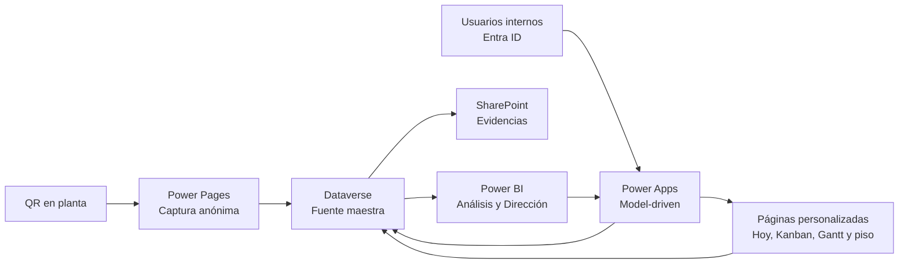

# 03. Aplicaciones, Power Pages, evidencias y Power BI

**Documento de diseño funcional y UX para la transferencia de PROpEx a Microsoft Power Platform**  
**Alcance:** Power Apps model-driven, páginas personalizadas/canvas, Power Pages, SharePoint y Power BI.  
**Fuente revisada:** aplicación Next.js actual, rutas `src/app/(app)`, captura pública `src/app/captura/[code]`, componentes de mando y estándares visuales PROpEx.

## 1. Decisión de arquitectura

PROpEx debe transferirse como una solución combinada, no como una sola aplicación canvas ni como una colección de flujos:

- **Power Apps model-driven** será la aplicación interna y el armazón de navegación, formularios, vistas, relaciones, comandos y auditoría.
- **Páginas personalizadas** dentro de la aplicación model-driven resolverán las superficies donde el diseño y la interacción sí cambian la calidad operativa: `Hoy`, bandeja universal, Kanban, ficha ejecutiva Kaizen, Gantt editable y captura/seguimiento GENBA en piso.
- **Power Pages** será el canal público, móvil y anónimo para la captura por QR.
- **SharePoint Online** será el repositorio documental de evidencias; Dataverse conservará la relación, el tipo de evidencia y la trazabilidad del expediente.
- **Power BI** será la capa analítica para Dirección y Mejora Continua. No se usará para editar estados ni para sustituir una bandeja operativa.
- **Dataverse** seguirá siendo la fuente maestra de estado, permisos y relaciones. Ninguna pantalla, archivo o visual tendrá un estado paralelo.
- **Power Automate no es requisito para renderizar estas experiencias.** Puede orquestar notificaciones, vencimientos o movimientos de archivos, pero la navegación, el permiso y el estado oficial no dependen de un flujo.

La separación es deliberada: **Power Apps sirve para actuar; Power BI, para analizar; SharePoint, para custodiar archivos; Power Pages, para recibir una idea sin cuenta corporativa**.

## 2. Hallazgos de la interfaz actual que se deben conservar

La revisión de código y de las capturas de escritorio/móvil confirma que el sistema actual ya tiene rasgos valiosos que no deben perderse:

- Navegación por módulos `Ideas`, `Kaizen` y `GENBA` y trabajo agrupado en pendiente, seguimiento y herramientas.
- Página `Hoy` con “Atención de hoy”, KPIs, embudo, SQDCM, antigüedad, tiempos de respuesta e ideas recientes.
- Bandeja universal `Mis seguimientos`, que reúne Ideas, actividades Kaizen y GENBA por responsabilidad, vencimiento y bloqueo.
- Flujo completo de Ideas: captura, supervisor, Calidad/Inocuidad, Seguridad Industrial, Mantenimiento, Mejora Continua, implementación, evidencia y cierre.
- Carpetas Kaizen con ficha ejecutiva, equipo, actividades, bitácora, Charter, ahorro, calendario, Gantt y Kanban.
- Recorridos GENBA con asistencia esperada/real, actividades, responsables, bitácora, evidencias y promoción a Kaizen.
- Libro mayor de ProbocaCoins con premios, ajustes, canjes, fuente, referencia y reverso auditable de duplicados.
- Entrenamientos con catálogo, sesiones, inscripción grupal, asistencia y entrega de ProbocaCoins.
- Repositorios históricos separados visualmente, pero relacionados con los mismos expedientes.
- Identidad Proboca basada en rojo `#EA0029`, blanco, grafito y grises; color departamental secundario por rol.

La transferencia no debe reducir lo anterior a listas genéricas de Dataverse. Las vistas estándar son correctas para administración y comparación; las decisiones urgentes requieren jerarquía y contexto propios.

## 3. Aplicaciones objetivo

### 3.1 PROpEx Operación — model-driven

Aplicación principal para todo usuario autenticado. Se publica dentro de una solución administrada y usa Entra ID.

Responsabilidades:

- navegación común y visible por rol;
- formularios y vistas de Ideas, Kaizen, GENBA, ProbocaCoins y Entrenamientos;
- comandos de decisión según estado y permiso;
- acceso a documentos de SharePoint desde el expediente;
- páginas personalizadas embebidas;
- tablero Power BI embebido sólo para quienes tengan licencia y autorización;
- enlaces profundos desde Teams/correo hacia el registro o tarea exactos.

### 3.2 PROpEx Piso — canvas responsiva

Aplicación canvas opcional, dirigida a tabletas o teléfonos corporativos usados durante un recorrido GENBA. No replica toda la aplicación interna.

Incluye únicamente:

- recorridos de hoy;
- toma de asistencia;
- alta rápida de hallazgo/actividad;
- fotografía y nota;
- responsable y compromiso;
- mis actividades abiertas;
- actualización de avance y evidencia;
- envío para verificación/cierre.

Debe trabajar en línea en la primera versión. No se prometerá operación sin conexión hasta diseñar sincronización, resolución de conflictos, almacenamiento local cifrado y pruebas de pérdida de señal.

### 3.3 PROpEx Captura — Power Pages

Sitio público optimizado para QR y teléfono. Sólo crea una solicitud de idea y devuelve un folio de recepción; no expone el expediente interno ni permite buscar otros registros.

### 3.4 PROpEx Dirección — Power BI

Reporte certificado para Dirección, líderes y Mejora Continua. Se puede consumir en Power BI y embebido como página de la aplicación model-driven. Todas las vistas respetan seguridad por planta/área.

## 4. Navegación objetivo

El mapa del sitio tendrá ocho entradas principales. Las subáreas se ocultan si el rol no tiene una tarea o decisión en ellas.

| Entrada | Propósito | Superficie primaria | Subáreas |
|---|---|---|---|
| **Hoy** | Responder qué requiere atención, quién responde y para cuándo | Página personalizada | Mis pendientes, en seguimiento, equipo; acceso a Panorama cuando aplique |
| **Ideas** | Capturar internamente, decidir, validar, implementar y cerrar Ideas | Vistas/formularios model-driven + diálogos personalizados | Aprobaciones, validaciones, Mejora Continua, implementación, Ideas activas, Kanban |
| **Kaizen** | Dirigir proyectos y actividades | Página personalizada + formulario model-driven | Portafolio, mis actividades, nuevo proyecto, Kanban, Gantt |
| **GENBA** | Preparar recorridos y cerrar hallazgos | Página personalizada/canvas + formulario model-driven | Recorridos, mis actividades, nuevo recorrido, Kanban |
| **ProbocaCoins** | Consultar saldo y controlar el libro mayor | Formulario/vistas model-driven + resumen personalizado | Mi saldo; saldos; movimientos; ajustes y reversos según permiso |
| **Entrenamientos** | Administrar catálogo, sesiones, asistencia y reconocimientos | Formularios y vistas model-driven | Programas, sesiones, asistencia, participantes |
| **Repositorios** | Consultar expedientes terminados sin duplicar datos | Vistas model-driven de sólo lectura operativa | Ideas, Kaizen, GENBA; exportaciones autorizadas |
| **Configuración** | Gobierno de usuarios, estructura, rutas, reglas y datos | Formularios model-driven | Organización, áreas/QR, reglas, catálogos, auditoría y control de datos |

Las notificaciones no compiten como un noveno módulo: se muestran en el encabezado, en `Hoy` y en una vista de historial accesible desde la campana. Los reportes tampoco se repiten: el acceso analítico se concentra en `Hoy > Panorama` y en `Power BI`.

## 5. Experiencia por rol

| Rol | Entrada al abrir | Trabajo principal visible | Ámbito de lectura | Acciones críticas |
|---|---|---|---|---|
| **Colaborador** | Hoy | Actividades propias, ideas que presentó o sigue, proyectos donde participa | Propio y asignado | Responder información, actualizar actividad, adjuntar evidencia, consultar su saldo |
| **Supervisor/Jefatura** | Hoy | Aprobaciones, actividades del área, bloqueos y vencimientos | Unidades bajo su alcance y asignaciones directas | Aprobar, rechazar con razón, solicitar información, reasignar dentro de alcance, verificar avance |
| **Calidad/Inocuidad** | Hoy | Validaciones de Calidad y apoyos asignados | Ideas/actividades donde participa o su alcance de soporte | Aprobar, rechazar o pedir información con dictamen obligatorio |
| **Seguridad Industrial** | Hoy | Validaciones de Seguridad y hallazgos críticos | Ideas/GENBA/Kaizen de su ámbito | Dictaminar, bloquear cierre por riesgo, solicitar evidencia |
| **Mantenimiento** | Hoy | Factibilidad, solicitudes de apoyo y acciones técnicas | Registros asignados o área de soporte | Dictaminar, estimar compromiso, ejecutar y evidenciar |
| **Mejora Continua** | Hoy | Cola global, clasificación, SLA, cartera Kaizen/GENBA y cierres | Operación global autorizada | Clasificar, priorizar, convertir a Kaizen, asignar, cerrar y reconocer |
| **Administración PROpEx** | Hoy | Salud del sistema, errores, huérfanos, seguridad y configuración | Global | Configurar, corregir datos con trazabilidad, mantener roles y catálogos |
| **Dirección** | Panorama Power BI | Desempeño, riesgo, impacto, capacidad y resultados | Planta/negocio autorizado | Filtrar, comparar, profundizar; sin editar operación |

Reglas de UX por rol:

1. `Hoy` existe para todos; cambia el contenido, no el destino.
2. La primera lista siempre contiene trabajo accionable, ordenado por vencido, hoy, próximo e impacto.
3. Las métricas aparecen después de los pendientes, excepto para Dirección.
4. Una acción no autorizada no se muestra deshabilitada: se oculta. El registro sigue protegido en servidor por Dataverse.
5. Toda decisión presenta folio, problema, área, solicitante, responsable actual, fecha compromiso y evidencia relevante sin obligar a navegar entre pestañas.

## 6. Asignación de pantallas: estándar, personalizada o analítica

### 6.1 Correspondencia con las rutas actuales

| Rutas/pantallas actuales | Destino Power Platform | Tipo | Decisión de diseño |
|---|---|---|---|
| `/dashboard`, `/seguimientos` | `Hoy` | **Página personalizada** | Fusiona centro de mando y bandeja universal; consulta Dataverse en vivo |
| `/panorama` | `Panorama PROpEx` | **Power BI embebido** | Corte ejecutivo, tendencias y portafolio completo |
| `/supervisor` | `Ideas > Aprobaciones` | **Vista model-driven + diálogo personalizado** | La vista compara; el diálogo concentra aprobar/rechazar/pedir información |
| `/validaciones/calidad` | `Ideas > Calidad e Inocuidad` | **Vista model-driven** | Cola filtrada por rol/propietario y SLA |
| `/validaciones/seguridad` | `Ideas > Seguridad Industrial` | **Vista model-driven** | Igual patrón, con prioridad de riesgo |
| `/validaciones/mantenimiento` | `Ideas > Mantenimiento` | **Vista model-driven** | Incluye factibilidad, responsable y compromiso |
| `/mejora` | `Ideas > Mejora Continua` | **Vista model-driven + formulario** | Clasificación, prioridad, propietario, fecha y conversión |
| `/implementacion` | `Ideas > Implementación` | **Vista model-driven + formulario rápido** | Avance y evidencia sin abrir un editor extenso |
| `/ideas` | `Ideas > Ideas activas` | **Vista model-driven** | Filtros, orden, búsqueda, exportación controlada y edición sólo autorizada |
| `/ideas/[id]` | `Expediente de Idea` | **Formulario model-driven** | Encabezado/BPF y pestañas Propuesta, Validaciones, Implementación, Evidencias, Conversación y Auditoría |
| `/kanban` | `Ideas > Kanban` | **Página personalizada** | Board por etapa con tarjetas compactas; cambio de estado sólo mediante comando válido |
| `/vencidas` | `Hoy > Compromisos vencidos` | **Vista model-driven** | Se abre desde el indicador y conserva filtros por responsable/área |
| `/ideas/repositorio` | `Repositorios > Ideas` | **Vista model-driven** | Mismos registros; filtro por estado terminal, formulario de consulta |
| `/kaizen` | `Kaizen > Portafolio` | **Página personalizada** | Salud, avance planeado/real, riesgos, ahorro y próximos hitos |
| `/kaizen/nuevo` | `Kaizen > Nuevo proyecto` | **Formulario model-driven** | Folio automático; Charter pendiente; idea origen opcional/obligatoria según caso |
| `/kaizen/[id]` | `Carpeta Kaizen` | **Formulario + resumen personalizado** | Ficha ejecutiva, equipo, plan, documentos, bitácora y cierre |
| `/kaizen/kanban` | `Kaizen > Kanban` | **Página personalizada** | Proyecto por tarjeta y actividades accesibles en panel lateral |
| `/kaizen/gantt` | `Kaizen > Gantt` | **Página personalizada/PCF** | Edición controlada de fechas; Power BI conserva el Gantt ejecutivo de sólo lectura |
| `/kaizen/repositorio` | `Repositorios > Kaizen` | **Vista model-driven** | Completados/cancelados, resultado, ahorro, equipo y evidencia |
| `/genba` | `GENBA > Recorridos` | **Página personalizada** | Asistencia, recurrencia, vencimientos, tiempo de cierre y conversión |
| `/genba/nuevo` | `GENBA > Nuevo recorrido` | **Canvas responsiva o página personalizada** | Optimizada para tableta, cámara, comité y actividades iniciales |
| `/genba/[id]` | `Expediente GENBA` | **Formulario + página de piso** | Asistencia, plan de acción, bitácora, documentos, verificación y cierre |
| `/genba/kanban` | `GENBA > Kanban` | **Página personalizada** | Recorrido por tarjeta y actividades desplegables |
| `/genba/repositorio` | `Repositorios > GENBA` | **Vista model-driven** | Cerrados/cancelados con asistencia, cumplimiento y conversiones |
| `/probocacoins` | `ProbocaCoins` | **Model-driven + resumen personalizado** | Saldo por persona, composición y libro mayor; reverso sin borrar original |
| `/entrenamientos` | `Entrenamientos` | **Model-driven** | Catálogo, sesión, inscripción/asistencia subgrid y movimientos ligados |
| `/qr` | `Configuración > Áreas y QR` | **Model-driven** | Mantiene código estable, vigencia, vista previa, descarga e impresión |
| `/notificaciones` | Campana > Historial | **Vista model-driven** | Pendientes, enviados y error, filtrados por destinatario/administrador |
| `/reportes` | `Panorama` y comandos de exportación | **Power BI + model-driven** | Analítica en BI; archivos operativos sólo desde vistas autorizadas |
| `/auditoria` | `Configuración > Auditoría` | **Vista de sólo lectura** | Actor, acción, entidad, fecha, detalle y correlación |
| `/configuracion`, `/configuracion/estructura` | `Configuración` | **Model-driven** | Usuarios, membresías, jerarquía, rutas, módulos, áreas y reglas |
| `/configuracion/datos` | `Configuración > Control de datos` | **Diálogo administrativo restringido** | Acciones destructivas con doble confirmación, razón y auditoría obligatoria |

### 6.2 `Hoy`: especificación de la página personalizada

`Hoy` no debe convertirse en un tablero de contadores. Su orden visual será:

1. **Encabezado compacto:** saludo, rol/ámbito, última actualización y filtros globales por periodo, planta, área, responsable y estatus. Los filtros que no aplican al rol no aparecen.
2. **Atención inmediata:** carriles `Vencido`, `Vence hoy`, `Bloqueado` y `Sin responsable`; cada fila abre el registro o el diálogo de decisión.
3. **Mis pendientes:** tabla unificada Idea/Kaizen/GENBA con folio, trabajo solicitado, ubicación, responsable, fecha, antigüedad y siguiente acción.
4. **En seguimiento / Equipo:** pestañas secundarias, equivalentes a la bandeja universal actual.
5. **Indicadores operativos:** sólo para Supervisión, Mejora Continua y Administración; cada KPI incluye meta, variación, tendencia y vínculo al detalle.
6. **Acceso a Panorama:** reporte Power BI embebido para Mejora Continua, Administración y Dirección.

En móvil, los filtros viven en un panel inferior; la tabla se transforma en filas apiladas, no en tarjetas anidadas. Las acciones primarias conservan un blanco táctil mínimo de 44 × 44 px.

### 6.3 Ideas

El formulario de Idea usa un Business Process Flow como orientación, sin convertirlo en la fuente única del estado:

`Registrada → Revisión supervisor → Validaciones de soporte → Clasificación MC → Implementación → Validación final → Cerrada`.

Variantes como rechazo, solicitud de información, cancelación y vencimiento se muestran como estado explícito, con razón, actor y fecha. No se comunican sólo por color.

Pestañas del expediente:

- **Resumen:** folio, estado, prioridad, área/planta, solicitante, problema, propuesta, beneficio, SQDCM, responsable y fecha.
- **Validaciones:** supervisor y soportes requeridos; estatus, dictamen, comentario, responsable, SLA y fecha.
- **Implementación:** clasificación, propietario, compromiso, avances, bloqueos y verificación final.
- **Evidencias:** Antes, Después y Otros documentos desde SharePoint.
- **Conversación:** comentarios y seguidores, con mención y cronología.
- **Relaciones:** Kaizen o GENBA de origen/destino y movimientos ProbocaCoins.
- **Auditoría:** historial de decisiones y cambios relevantes.

Los comandos `Aprobar`, `Rechazar`, `Solicitar información`, `Clasificar`, `Asignar`, `Marcar implementada`, `Validar cierre` y `Cerrar` se muestran según estado y rol. Cada comando valida la versión del registro para evitar decisiones sobre datos desactualizados.

### 6.4 Kaizen

La página `Portafolio Kaizen` contiene:

- salud de cartera por estado y área;
- planeado contra real por proyecto;
- proyectos con Charter pendiente;
- hitos próximos, actividades vencidas y bloqueos;
- ahorro estimado, validado y real;
- carga por responsable;
- matriz impacto-esfuerzo;
- acceso a Gantt y al expediente.

La carpeta Kaizen conserva en una sola relación la Idea de origen, el líder, el equipo y las actividades. El encabezado muestra línea base, meta y valor actual, progreso, fechas, salud y ahorro. Los proyectos `Completado` o `Cancelado` pasan a vista de repositorio, pero no se mueven ni copian.

El Gantt operativo permite editar fechas sólo a líder, Mejora Continua o administrador y valida dependencias/fechas. El Gantt de Power BI es de lectura y comparación de cartera.

### 6.5 GENBA

La experiencia de piso prioriza velocidad y evidencia:

- seleccionar recorrido/área;
- confirmar asistencia esperada y real por departamento;
- capturar problema, acción, responsable, fecha y fotografía;
- guardar borrador y continuar con el siguiente hallazgo;
- actualizar avance con una mano;
- verificar efectividad y cerrar;
- promover actividad a Kaizen sin recapturar problema, evidencia ni responsable.

La página de mando presenta asistencia semanal, actividades abiertas/vencidas, tiempo de cierre, recurrencia, mapa de calor área–categoría y conversión a Kaizen. La recurrencia se calcula con categorías/áreas normalizadas; no mediante coincidencia libre de texto.

### 6.6 ProbocaCoins

Se conservan dos experiencias:

- **Mi saldo:** disponible para el participante autenticado; saldo, movimientos, origen, fecha y referencia, sin información de terceros.
- **Finanzas ProbocaCoins:** sólo Mejora Continua/Administración; saldos por persona, nuevo movimiento, composición por origen, filtros y libro mayor.

El libro mayor es inmutable. Un duplicado se corrige con contrapartida enlazada y razón; nunca se elimina el movimiento original. La pantalla debe mostrar claramente `Original`, `Reverso` y `Corregido`. La suma visual es resultado de movimientos confirmados en Dataverse, no una cifra escrita por Power Apps ni Power BI.

### 6.7 Entrenamientos

El diseño estándar model-driven cubre bien esta operación:

- programa y valor vigente en ProbocaCoins;
- sesión, fecha, planta, unidad, instructor y notas;
- inscripción masiva con prevención de duplicado;
- asistencia `Registrado`, `Completado` o `Cancelado`;
- movimiento financiero relacionado al completar;
- directorio de participantes activo/inactivo sin perder historial.

La asistencia masiva puede usar una página personalizada sólo si la cuadrícula estándar no alcanza el tiempo objetivo de operación. Criterio: registrar 30 personas en menos de 3 minutos, con teclado o toque.

### 6.8 Repositorios

`Ideas`, `Kaizen` y `GENBA` terminados son **vistas de las tablas maestras**, no tablas históricas ni copias. El formulario abre en modo de consulta para roles operativos; correcciones excepcionales requieren un comando administrativo y quedan auditadas.

Filtros comunes:

- periodo, planta, departamento/área;
- estado terminal y motivo;
- responsable/líder/coordinador;
- clasificación/SQDCM;
- evidencia completa/incompleta;
- ProbocaCoins o ahorro;
- vínculo Idea → Kaizen y GENBA → Kaizen.

## 7. Captura pública por QR con Power Pages

### 7.1 Ruta y seguridad

Cada QR contiene una URL estable como:

`https://ideas.proboca.mx/registrar?area=CAR-PROD-01`

El código identifica una `Ruta de captura` activa y un área visible; no contiene el GUID de usuario, correo del supervisor ni secretos. La página muestra área, planta y nombre del receptor, pero la asignación interna se resuelve en Dataverse al crear el expediente.

La identidad anónima tendrá:

- permiso **Create** únicamente sobre una tabla de etapa `Solicitud pública de Idea`;
- sin permiso Read, Update o Delete sobre `Idea`, `Usuario`, `Participante`, `Aprobación`, `Movimiento` o documentos internos;
- lectura sólo de una proyección pública de rutas activas, sin correos ni identificadores internos;
- CAPTCHA para anónimos, validación del lado del servidor y límites de frecuencia;
- identificador de solicitud para impedir doble envío al reintentar;
- registro de consentimiento/aviso de privacidad vigente.

No se concederá lectura global anónima a la tabla de Ideas. Microsoft advierte que una tabla ligada al rol anónimo puede quedar visible para cualquier visitante; por eso la concesión se limita a la tabla de etapa y al mínimo de datos públicos.

### 7.2 Formulario de tres pasos

La secuencia replica el formulario actual:

1. **Tus datos:** nombre completo obligatorio; número de empleado y correo opcionales; turno; puesto/circunstancia para elegir ruta jerárquica.
2. **La oportunidad:** problema observado, propuesta y mejora esperada, con ejemplos breves y límites visibles.
3. **Categoría, apoyo e impacto:** participantes, impactos SQDCM, Calidad/Inocuidad, Seguridad, Mantenimiento, apoyo externo y evidencia `Antes` opcional.

El área viene bloqueada por el QR, pero se muestra en todo momento. Antes de enviar se enseña un resumen. Al concluir:

- se crea una sola solicitud;
- se asigna un folio de recepción legible;
- se confirma el área receptora;
- se ofrece guardar/capturar pantalla del folio;
- no se muestra un vínculo que permita leer el expediente interno;
- un segundo intento con el mismo identificador devuelve la confirmación existente.

### 7.3 Evidencia anónima

En la primera versión sólo se aceptan JPG, PNG y PDF, con límite definido por Seguridad de la Información. El archivo anónimo se guarda en almacenamiento de etapa y pasa validación antes de incorporarse a la biblioteca SharePoint del expediente. Power Pages no debe exponer una biblioteca SharePoint interna al rol anónimo.

### 7.4 Estados de la captura

- **Carga:** estructura del formulario visible y mensaje “Preparando la ruta de tu idea”.
- **Ruta inválida/inactiva:** explicar que el QR no está disponible y mostrar contacto general; no permitir envío sin receptor.
- **Validación:** enfocar el primer campo incorrecto y presentar un resumen enlazado a cada error.
- **Envío:** botón bloqueado, progreso con texto y protección contra doble toque.
- **Error recuperable:** conservar los datos locales, mostrar `Reintentar` y código de soporte.
- **Éxito:** folio, fecha/hora, área receptora y próximo paso.

## 8. SharePoint para evidencias

### 8.1 Estructura documental

Sitio: `PROpEx Operación`  
Biblioteca: `Evidencias PROpEx`

Rutas lógicas:

- `Ideas/{Folio}/`
- `Kaizen/{Folio}/Charter/`
- `Kaizen/{Folio}/Evidencias/`
- `GENBA/{Folio}/`
- `Entrenamientos/{Año}/{Sesión}/`

Se usarán ubicaciones de documento relacionadas con Dataverse, no campos de URL escritos manualmente. Metadatos mínimos:

- tipo de expediente;
- GUID Dataverse y folio;
- planta, unidad y área;
- tipo de evidencia (`Antes`, `Después`, `Charter`, `Verificación`, `Otro`);
- etapa/actividad relacionada;
- fecha de captura y autor;
- clasificación y retención documental;
- estado de revisión.

### 8.2 Reglas de gobierno

- Versionado y papelera habilitados; nadie sobrescribe silenciosamente una evidencia.
- Los permisos se derivan del expediente y del rol; no se comparten carpetas con enlaces públicos.
- El nombre visible del archivo se conserva, pero el almacenamiento usa nombre seguro y único.
- Los archivos no contienen el estado oficial; una evidencia se relaciona con el registro de Dataverse.
- Eliminar un registro no elimina automáticamente su evidencia sin una política aprobada.
- ProbocaCoins y datos de personas no comparten biblioteca abierta con evidencias operativas.
- Las exportaciones masivas y descargas quedan restringidas y auditadas.

La integración servidor a servidor de SharePoint con Dataverse permite mostrar documentos relacionados dentro del formulario model-driven. Debe habilitarse por ambiente y para cada tabla documental.

## 9. Power BI: modelo y páginas

### 9.1 Modelo semántico

Modelo estrella recomendado:

- dimensiones `Fecha`, `Planta`, `Unidad`, `Área`, `Persona`, `Rol`, `Estado`, `Clasificación`, `SQDCM`;
- hechos `Ideas`, `Transiciones de Idea`, `Decisiones/SLA`, `Actividades Kaizen`, `Valores Kaizen`, `Actividades GENBA`, `Asistencia GENBA`, `ProbocaCoins` y `Entrenamientos`;
- puentes para impactos SQDCM múltiples, equipos de proyecto y asistentes;
- calendario único y relaciones de fecha activas/inactivas según captura, compromiso, decisión y cierre.

La historia de transición debe conservar `estado anterior`, `estado nuevo`, `inicio`, `fin`, `duración`, `actor`, `responsable` y `SLA aplicable`. Calcular antigüedad sólo con el estado actual impide reconstruir desempeño pasado.

### 9.2 Páginas del reporte

| Página | Pregunta directiva | Visuales y navegación |
|---|---|---|
| **Resumen ejecutivo** | ¿Dónde está el valor y dónde está el riesgo? | KPIs con meta/variación/tendencia; portafolio Ideas–Kaizen–GENBA; ahorro; ProbocaCoins; alertas |
| **Embudo de Ideas** | ¿En qué etapa se pierde o detiene la participación? | Embudo captura→cierre, tasa por etapa, entradas/salidas, drill-through al listado |
| **SLA y antigüedad** | ¿Qué decisiones tardan y con quién? | % dentro de SLA, horas/días P50/P90, cohortes 0–2, 3–7, 8–14, 15–30, +30, responsable y etapa |
| **Impacto SQDCM** | ¿Qué problemas atacamos y con qué resultado? | Barras por impacto, tendencia, área, clasificación y resultado; sin pastel de muchas categorías |
| **Kaizen** | ¿El portafolio entrega metas y ahorro? | Gantt, planeado vs real, línea base/meta/actual, ahorro estimado vs real, hitos, bloqueos, carga e impacto-esfuerzo |
| **GENBA** | ¿Los recorridos detectan y cierran recurrencias? | Asistencia semanal, mapa de calor área–categoría, actividades abiertas/vencidas, tiempo de cierre, recurrencia, promoción a Kaizen |
| **Participación y reconocimiento** | ¿Quién participa y cómo se reconoce? | Cobertura por área/turno, autores/equipos, entrenamiento, ProbocaCoins otorgadas/canjeadas/saldo |
| **Calidad de datos** | ¿Qué impide confiar en el tablero? | Sin responsable, sin fecha, ruta inactiva, evidencia faltante, duplicado potencial y actualización del modelo |

### 9.3 Medidas obligatorias

- ideas registradas, cerradas, rechazadas y canceladas;
- tasa de cierre y conversión por etapa;
- tiempo de ciclo total y por etapa, mediana y P90;
- cumplimiento de SLA por supervisor/soporte;
- antigüedad abierta y vencimiento;
- backlog neto: entradas menos cierres;
- avance planeado/real Kaizen;
- actividades abiertas, vencidas y bloqueadas;
- ahorro estimado, validado y real;
- asistencia GENBA y tiempo de cierre;
- recurrencia y conversión GENBA → Kaizen;
- participación única y repetición por persona/área/turno;
- ProbocaCoins otorgadas, revertidas, canjeadas y saldo;
- cobertura/completitud de evidencias y datos.

Cada KPI muestra meta, periodo comparativo, variación absoluta/porcentual y fecha de actualización. Seleccionar una barra filtra el reporte; `Ver registros` abre un drill-through y, cuando exista autorización, un enlace profundo al registro en Power Apps.

### 9.4 Actualización y seguridad

- `Hoy` y las bandejas consultan Dataverse directamente; no dependen de la actualización de Power BI.
- El reporte ejecutivo puede usar importación e incremental refresh, con frecuencia acordada con Dirección; la hora del último corte siempre es visible.
- RLS limita planta/unidad/área y se alinea con grupos Entra o tabla de alcance; no se deriva de un filtro visual.
- Un enlace profundo nunca sustituye seguridad Dataverse: sin permiso, el registro no abre.
- El tablero embebido requiere autorización y licencia Power BI correspondiente; esto se valida antes de prometer acceso general.

## 10. Seguridad funcional

La navegación se basa en grupos Entra y roles Dataverse, pero la protección efectiva se aplica a tabla, fila y columna.

| Capa | Controles mínimos |
|---|---|
| Identidad | Entra ID, MFA según política, grupos por función, cuentas de servicio sin uso interactivo |
| Dataverse | Unidades de negocio/equipos por planta, roles mínimos, ownership, sharing explícito, field security para datos sensibles |
| Aplicaciones | Sitemap y comandos por rol/estado; sin secretos en fórmulas, URLs o variables cliente |
| Power Pages | anónimo create-only en tabla de etapa, CAPTCHA, sin lectura de expedientes, validación servidor y anti-duplicado |
| SharePoint | integración servidor a servidor, sin enlaces públicos, permisos coherentes, versionado, retención y auditoría |
| Power BI | workspace/app por audiencia, RLS, exportación restringida, sin “Publish to web” |

Las áreas departamentales conservan sus colores como contexto: Supervisor verde, Calidad rojo, Seguridad gris, Mantenimiento azul, Mejora Continua/Administración grafito. Un semáforo usa además icono y texto (`Vencido`, `En riesgo`, `Dentro de fecha`) para no confundirse con el color del rol.

## 11. Sistema visual, accesibilidad y contenido

### 11.1 Tokens y personalidad

- Acción/selección de marca: `#EA0029` con contraste verificado en el fondo real.
- Superficie: blanco y gris neutro; texto: grafito/negro.
- Rojo de marca no significa automáticamente error; error/destrucción siempre añade icono, verbo y explicación.
- Tipografía compacta, cifras tabulares y densidad suficiente para operación industrial.
- Radios moderados, sin gradientes decorativos ni tableros compuestos sólo por tarjetas.
- Logotipos y sonrisa Proboca se reutilizan sin reinterpretación. En la navegación model-driven se suministran SVG oficiales/adaptados, porque el aspecto moderno usa iconos SVG.

### 11.2 Reglas de accesibilidad

- WCAG 2.2 nivel AA como criterio mínimo interno.
- Contraste 4.5:1 para texto normal; 3:1 para texto grande, foco y componentes no textuales.
- Foco visible, orden lógico por teclado y sin trampas en páginas personalizadas/PCF.
- Etiqueta persistente; placeholder nunca sustituye label.
- Mensaje de error asociado al campo, resumen de errores y foco en el primero.
- Objetivos táctiles de 44 × 44 px en piso y captura QR.
- Gráficas con título, unidad, leyenda, tooltip, alternativa tabular y estado sin datos.
- No depender de hover, color o animación para conocer estado/acción.
- Reflow sin desplazamiento horizontal a 320 CSS px, excepto Gantt/tablas justificadas con alternativa móvil.
- Respeto a zoom 200 %, preferencias de reducción de movimiento y alto contraste.

Las páginas personalizadas se construyen con contenedores horizontal/vertical responsivos y controles modernos. El orden visual también debe ser el orden semántico y de tabulación.

## 12. Estados vacíos, carga y error

| Contexto | Vacío | Carga | Error |
|---|---|---|---|
| **Hoy** | “No tienes pendientes” + siguiente acción útil; no mostrar 0 en diez tarjetas | Skeleton de filas y hora de consulta | Reintentar, conservar filtros y mostrar ID de correlación |
| **Vista model-driven** | Explicar el filtro activo y ofrecer limpiarlo/crear si hay permiso | Indicador estándar sin bloquear navegación global | Mensaje de servicio; nunca mostrar una lista vacía como si fuera éxito |
| **Expediente** | Sección “Aún no hay evidencias/comentarios” con CTA autorizado | Bloques de formulario, no spinner de página completa | Evitar edición; recuperar/reabrir; advertir conflicto de versión |
| **Power Pages** | No aplica al formulario; ruta inactiva tiene estado propio | Preservar estructura y bloquear doble envío | Conservar captura, reintentar y ofrecer canal de soporte |
| **SharePoint** | “Sin evidencia” y política del cierre | Progreso por archivo y cola de subida | Archivo fallido individual; otros archivos no se pierden |
| **Power BI** | Visual con explicación “No hay datos para estos filtros” | Indicador y último corte conocido | Página de diagnóstico con reintento; no reutilizar cifras antiguas sin advertencia |

Se prueban además: un registro, mil registros, texto largo, nombres duplicados, folio inexistente, archivo grande/no permitido, conexión lenta y permisos revocados durante una sesión.

## 13. Pruebas de experiencia y aceptación

### 13.1 Escritorio

Matriz mínima: Edge y Chrome corporativos; 1366 × 768, 1440 × 900 y 1920 × 1080; zoom 100 %, 125 % y 200 %.

- navegación completa por teclado, foco y lector de pantalla en rutas críticas;
- menú visible por rol y protección al pegar una URL no autorizada;
- filtros globales persistentes dentro del módulo, no entre usuarios;
- tablas con 0, 1, 50 y 1,000+ registros, encabezado claro y paginación/delegación;
- diálogo de decisión sin pérdida de contexto;
- concurrencia: dos usuarios intentan decidir/reasignar el mismo registro;
- enlace profundo desde correo/Teams;
- apertura, carga, reemplazo y versionado de evidencia;
- drill-through Power BI y retorno al expediente;
- exportación restringida según rol.

### 13.2 Móvil y piso

Matriz mínima: 320 × 568, 360 × 800, 390 × 844 y 412 × 915; Android corporativo/iPhone de referencia; retrato y paisaje donde aplique.

- QR abre el área correcta desde cámara nativa;
- formulario completado con pulgar, teclado y dictado;
- cámara entrega fotografía y conserva orientación;
- error de red no borra la idea capturada;
- ningún botón queda debajo del teclado virtual;
- `Hoy` enseña antes la acción, no el gráfico;
- tabla unificada se adapta sin cortar folio, estado o vencimiento;
- alta GENBA permite encadenar cinco actividades sin volver al inicio;
- 44 × 44 px táctiles, foco/lector y contraste al sol;
- Gantt ofrece una lista alternativa por hitos; no obliga a manipular una línea temporal estrecha.

### 13.3 Casos por rol

Cada rol se prueba con una cuenta realista y otra sin asignaciones:

1. Colaborador sólo ve lo propio/asignado y su saldo.
2. Supervisor ve su equipo, decide dentro de alcance y no abre otra planta.
3. Calidad, Seguridad y Mantenimiento ven sólo las validaciones/apoyos pertinentes.
4. Mejora Continua clasifica, convierte, asigna y cierra con trazabilidad.
5. Administración configura sin convertirse automáticamente en aprobador del proceso.
6. Dirección consume Power BI y no puede mutar Dataverse.
7. Anónimo crea una solicitud por QR y no puede leer ninguna Idea.

### 13.4 Umbrales de aceptación UX

- Un responsable identifica su pendiente más urgente en menos de 10 segundos.
- Una aprobación estándar se completa en menos de 60 segundos sin perder el contexto.
- La captura QR típica se completa en menos de 3 minutos.
- Un hallazgo GENBA con fotografía, responsable y fecha se registra en menos de 90 segundos.
- El primer contenido útil de `Hoy` aparece dentro del objetivo de rendimiento acordado y siempre muestra cuándo fue actualizado.
- Cero pérdida de datos al corregir validaciones de formulario o reintentar una solicitud idempotente.

## 14. Brechas de fidelidad y mitigación

| Severidad | Brecha probable | Impacto | Mitigación/decisión |
|---|---|---|---|
| **Alta** | La navegación y formularios model-driven no replican exactamente el shell PROpEx actual | Riesgo de sentirse como CRM genérico y de perder jerarquía operativa | Conservar `Hoy`, portafolios, Kanban y piso como páginas personalizadas; tema Proboca e iconografía propia; no personalizar el DOM fuera de extensiones soportadas |
| **Alta** | Power BI puede mostrar datos con retraso | Una cifra analítica no sirve para decidir una tarea recién creada | Bandejas y contadores accionables consultan Dataverse; BI muestra hora del corte |
| **Alta** | Permiso anónimo mal configurado en Power Pages | Exposición de Ideas o datos de personas | Tabla de etapa create-only, pruebas de enumeración y lectura, sin enlace interno en confirmación |
| **Alta** | SharePoint y Dataverse pueden desalinear permisos | Evidencia visible a quien no ve el expediente | Integración servidor a servidor, grupos/roles homologados, pruebas de acceso y sin enlaces públicos |
| **Media** | Gantt/Kanban estándar no alcanza la claridad del sistema actual | Menor capacidad de detectar bloqueos y editar calendario | Página personalizada o PCF probado; alternativa tabular y BI sólo de lectura |
| **Media** | La app móvil model-driven prioriza consistencia sobre una interacción de piso | Más toques en GENBA | Canvas `PROpEx Piso` de alcance deliberadamente pequeño |
| **Media** | Custom pages no heredan automáticamente todo el aspecto moderno de model-driven | Inconsistencia visual | Biblioteca de componentes/tokens PROpEx y revisión visual por release |
| **Media** | Colores de rol y semáforos compiten | Estado mal interpretado | Etiqueta, icono y patrón además de color; color de rol reservado a acento contextual |
| **Media** | Visuales Power BI o PCF pueden degradar teclado/lector | Exclusión de usuarios y falla de cumplimiento | Aceptar sólo visuales certificados/probados y ofrecer tabla equivalente |
| **Baja** | Algunas microanimaciones, paneles laterales o densidad del sistema web no serán idénticos | Diferencia estética menor | Priorizar tiempo de tarea, legibilidad y soporte de plataforma sobre copia píxel a píxel |

## 15. Orden de construcción recomendado

1. Tema, navegación, roles y vistas model-driven base.
2. `Hoy` y bandeja universal con datos reales y seguridad por alcance.
3. Formularios/decisiones de Ideas y captura Power Pages.
4. SharePoint para documentos y migración de evidencias piloto.
5. Kaizen: carpeta, actividades, portafolio, Kanban y Gantt.
6. GENBA: expediente, experiencia de piso y conversión a Kaizen.
7. ProbocaCoins y Entrenamientos.
8. Repositorios, auditoría, configuración y exportaciones.
9. Modelo semántico y reporte Power BI certificado.
10. Pruebas por rol, dispositivo, accesibilidad, rendimiento, seguridad y operación paralela.

## 16. Criterios de “terminado” para esta capa

- Las ocho entradas de navegación existen y se ocultan/muestran correctamente por rol.
- Cada ruta actual tiene destino funcional o retiro explícito; ninguna capacidad queda “para después” sin responsable.
- `Hoy` reúne Ideas, Kaizen y GENBA con fecha, responsable, urgencia y siguiente acción.
- El QR anónimo crea una única solicitud y no permite leer datos internos.
- Evidencias de Idea, Kaizen y GENBA se abren desde el expediente y viven en SharePoint con metadatos y versionado.
- Repositorios son vistas de registros terminales, no copias.
- El reporte Power BI incluye embudo, SLA, antigüedad, SQDCM, Gantt/Kaizen y GENBA, con RLS y drill-through.
- Estados vacío, carga, error y conflicto están diseñados y probados.
- Desktop, móvil, teclado, lector, zoom y toque pasan la matriz de aceptación.
- La experiencia mantiene identidad Proboca y no depende sólo de componentes genéricos donde el trabajo operativo exige contexto.

## 17. Autocrítica y decisiones pendientes

Esta propuesta preserva la lógica y la jerarquía de la interfaz actual, pero **no promete fidelidad píxel a píxel**. El shell model-driven impone Fluent, espaciado, encabezados y comandos propios; forzarlo mediante personalizaciones no soportadas elevaría el costo y el riesgo de actualización. La fidelidad se concentra donde genera valor: `Hoy`, decisiones, Kaizen, Gantt, GENBA en piso y visualización directiva.

Hay cuatro decisiones que necesitan validación antes de construir:

1. **Licenciamiento y audiencia:** quién tendrá Power Apps Premium, Power Pages y Power BI; esto define el alcance embebido y móvil.
2. **Modelo organizacional definitivo:** plantas, unidades, rutas jerárquicas y usuarios con alcance global; sin esto no puede cerrarse RLS ni seguridad por fila.
3. **Política documental:** tipos/tamaños permitidos, retención, clasificación y tratamiento de fotografías anónimas.
4. **Operación sin conexión:** si GENBA realmente requiere offline; incorporarlo después de construir la app cambia el diseño de datos y sincronización.

También debe validarse con usuarios reales de piso. El código actual revela los campos y estados, pero no demuestra por sí mismo tiempos de tarea, conectividad, iluminación, guantes, tamaño de dispositivo ni alfabetización digital. La prueba piloto debe observar una aprobación, una captura QR, cinco hallazgos GENBA y un cierre con evidencia antes de declarar la experiencia transferida.

## 18. Referencias oficiales de implementación

- [Visión general de aplicaciones model-driven](https://learn.microsoft.com/en-us/power-apps/maker/model-driven-apps/model-driven-app-overview)
- [Agregar una página personalizada a una aplicación model-driven](https://learn.microsoft.com/en-us/power-apps/maker/model-driven-apps/add-page-to-model-app)
- [Diseñar páginas personalizadas responsivas y accesibles](https://learn.microsoft.com/en-us/power-apps/maker/model-driven-apps/design-page-for-model-app)
- [Permisos de tabla en Power Pages](https://learn.microsoft.com/en-us/power-pages/security/assign-table-permissions)
- [Formularios, CAPTCHA y adjuntos en Power Pages](https://learn.microsoft.com/en-us/power-pages/getting-started/add-form)
- [Administrar documentos SharePoint desde Dataverse/Power Pages](https://learn.microsoft.com/en-us/power-pages/configure/manage-sharepoint-documents)
- [Agregar visuales Power BI a una aplicación model-driven](https://learn.microsoft.com/en-us/power-apps/maker/model-driven-apps/add-powerbi-visual)

