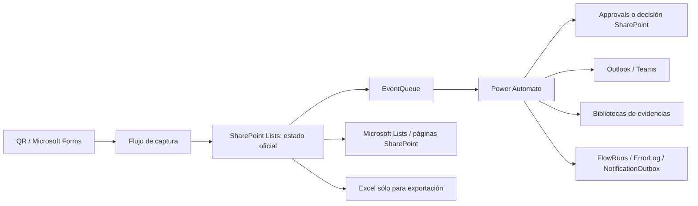

# PROpEx con Power Automate y Microsoft 365 estándar

## 1. Decisión ejecutiva

Sí es posible operar una versión funcional de PROpEx sin tablas propias de Dataverse ni conectores premium. La combinación viable es:

- Microsoft Forms para captura por QR y formularios internos simples.
- SharePoint Online/Microsoft Lists para los expedientes, catálogos, colas, bitácora y libro mayor.
- Bibliotecas de SharePoint para evidencias.
- Power Automate como orquestador.
- Outlook y Teams para comunicación.
- Approvals para decisiones humanas, con una salvedad importante explicada abajo.

Esta versión no tiene la misma solidez que Dataverse. SharePoint es un almacén colaborativo con listas y documentos, no una base de datos relacional/transaccional. Power Automate tampoco debe convertirse en la base de datos ni en el lugar donde residen saldos, permisos o estados maestros. Los flujos leen y escriben registros; SharePoint conserva el registro oficial.

Recomendación de alcance:

| Nivel | Uso recomendado |
| --- | --- |
| Adecuado | Una planta o despliegue gradual, volumen moderado, procesos internos, equipo de soporte M365 y tolerancia a consistencia eventual. |
| Aceptable con controles | Varias plantas con listas indexadas, partición documental, folios basados en ID y conciliaciones diarias. |
| No recomendable | Contabilidad con valor monetario, miles de escrituras simultáneas, seguridad fina por expediente, integraciones externas críticas, SLA contractual o auditoría regulatoria estricta. |

## 2. Qué significa realmente “sin Dataverse”

Existen dos interpretaciones y deben decidirse antes de construir:

### Opción A — Sin tablas Dataverse de PROpEx, usando Approvals

Es la opción recomendada. PROpEx no crea ni consulta tablas de negocio en Dataverse y no usa el conector Dataverse. Sin embargo, el servicio de Approvals puede aprovisionar automáticamente una base del entorno para su funcionamiento interno. Microsoft documenta que Approvals es un conector estándar y que ese aprovisionamiento puede ocurrir incluso en el entorno predeterminado.

Resultado: no hay licencia premium por usar el conector estándar, pero no es “cero Dataverse” en sentido físico.

### Opción B — Cero Dataverse estricto

No se usa Approvals. Cada decisión se registra en una lista `ApprovalRequests` mediante el formulario de edición de SharePoint, con permisos a revisores internos, o mediante un Microsoft Form interno cuya respuesta se valida contra el correo asignado y una clave de solicitud.

Resultado: todo queda en M365 estándar, pero la experiencia es inferior a Approvals y la protección depende más de SharePoint, grupos y validación del flujo.

Este documento diseña la Opción A y marca el reemplazo de la Opción B en cada flujo de aprobación.

## 3. Arquitectura lógica



Principios:

1. Forms recibe datos; no es el expediente.
2. SharePoint guarda el estado actual e historial funcional.
3. `EventQueue` desacopla las modificaciones de negocio de los avisos y procesos posteriores.
4. Cada efecto importante tiene una clave única antes de ejecutarse.
5. Ninguna aprobación mantiene una ejecución abierta más de 25 días.
6. Excel no recibe escrituras operativas concurrentes.
7. Los procesos financieros son append-only y se concilian; nunca se “arreglan” borrando filas.

## 4. Servicios, conectores y licencia

| Servicio/conector | Clase | Uso en PROpEx | Requisito/licencia |
| --- | --- | --- | --- |
| Microsoft Forms | Estándar | Captura de Idea, actualización interna y asistencia. | Plan M365 que incluya Forms y Power Automate. El conector usa cuenta organizacional. |
| SharePoint | Estándar | Listas, documentos, páginas, vistas, bitácora y colas. | SharePoint Online y acceso del propietario de conexiones. |
| Office 365 Outlook | Estándar | Acuses, recordatorios, escalaciones y resúmenes. | Exchange Online; buzón funcional o compartido con permisos. |
| Microsoft Teams | Estándar | Mensajes de canal/chat y ligas a expedientes. | Teams incluido y política que permita Flow bot/usuario. |
| Approvals | Estándar | Supervisor y validaciones humanas. | Derecho a Power Automate con conectores estándar; puede aprovisionar base del entorno. |
| Office 365 Users | Estándar | Resolver perfil/correo y, cuando aplique, jefe. | Directorio organizacional accesible al flujo. No sustituye el catálogo de rutas. |
| OneDrive for Business | Estándar | Archivos temporales o exportación personal excepcional. | No usar como repositorio corporativo principal. |
| Excel Online (Business) | Estándar | Exportación o snapshot de sólo lectura. | No usar como ledger ni expediente; límite del conector y bloqueo de archivo aplican. |
| HTTP, SQL, Dataverse, Azure Key Vault, custom connectors | Excluidos | Ninguno. | Se consideran fuera del diseño estándar/no premium. |

No se debe asumir que cualquier suscripción M365 concede exactamente los mismos derechos. TI debe confirmar que el SKU de cada propietario/usuario incluye Power Automate, Forms, SharePoint, Exchange y Teams. Los flujos deben pertenecer a una cuenta funcional licenciada, no a un desarrollador.

Sin una base Dataverse tampoco se debe depender de soluciones, variables de entorno ni connection references. La configuración se conserva en la lista `Settings`, los nombres/IDs de sitio y listas se documentan, y el despliegue usa paquetes exportados/importados con reconexión manual y checklist.

## 5. Diseño de almacenamiento en SharePoint

Sitio dedicado: `https://{tenant}.sharepoint.com/sites/PROpEx`.

### 5.1 Listas de referencia

| Lista | Contenido | Índices/clave |
| --- | --- | --- |
| `Areas` | Planta, código, nombre, QR activo, supervisor, unidad padre. | `AreaCode` único; índices en planta/activo. |
| `RoutingRules` | Área, categoría, circunstancia, revisor y nivel de escalación. | `RouteKey` único; índices área/activo/prioridad. |
| `SupportAreas` | Calidad, Seguridad, Mantenimiento y apoyos dinámicos. | `SupportCode` único; planta/activo. |
| `PointRules` | Reglas versionadas y puntos. | `RuleVersionKey` único. |
| `Settings` | URLs, umbrales, calendario, owners y feature flags. | `SettingKey` único. |

### 5.2 Listas de negocio

| Lista | Contenido principal | Claves e índices obligatorios |
| --- | --- | --- |
| `Ideas` | Expediente maestro, folio, participante, etapa, prioridad, clasificación, responsable, fechas, versión de acción y SLA. | `SourceKey` único; `Folio` único; índices en estado, área, supervisor, responsable, fecha y año. |
| `ApprovalRequests` | Una fila por supervisor/validador/apoyo/ronda; ID externo de Approvals y respuesta. | `ApprovalKey` único; índices en IdeaId, estado, asignado, ronda y vencimiento. |
| `IdeaFollowers` | Seguidores y razón. | `FollowerKey = IdeaId:UPN` único. |
| `KaizenProjects` | Proyecto, origen, líder, Charter, métricas, estado y cierre. | `SourceIdeaKey` único si existe; `Folio` único; estado/líder/fecha. |
| `KaizenActivities` | Actividad, número, responsable, fecha, estado y evidencia. | `ActivityKey = ProjectId:Number` único; proyecto/estado/responsable/fecha. |
| `KaizenTeam` | Integrantes, rol y recompensa objetivo. | `TeamKey = ProjectId:UPN` único. |
| `GenbaWalks` | Recorrido, coordinador, asistencia, área, estado y cierre. | `Folio` único; estado/coordinador/fecha. |
| `GenbaActivities` | Hallazgo, acción, responsable, fecha, estado y promoción. | `ActivityKey = WalkId:Number` único; `PromotionKey` único cuando aplica. |
| `Participants` | Número de empleado, nombre, correo, área y activo. | `EmployeeNumber` único; correo y activo indexados. |
| `TrainingPrograms` | Programa, valor, versión y activo. | `ProgramKey` único. |
| `TrainingSessions` | Programa, fecha, planta/área y entrenador. | `SessionKey` único; fecha/programa. |
| `TrainingEnrollments` | Sesión, participante, estado, completado y monedas. | `EnrollmentKey = SessionId:ParticipantId` único. |
| `CoinLedger` | Movimiento append-only, participante, tipo, origen, monto, reverso y fecha. | `TransactionKey` único; índices participante, origen, SourceKey, fecha y reverso. |

Usar columnas numéricas/texto para IDs padre y datos denormalizados mínimos. Evitar una malla grande de columnas Lookup: no crea integridad referencial real y complica consultas. El flujo valida que el padre exista.

### 5.3 Listas técnicas

| Lista | Función | Retención |
| --- | --- | --- |
| `EventQueue` | Evento inmutable pendiente/procesando/completado/error. | 12 meses; archivar completados por año. |
| `FlowRuns` | Claim de idempotencia, correlation ID, intento, resultado y duración. | 12 meses o política corporativa. |
| `NotificationOutbox` | Mensaje, destinatario, canal, plantilla, intento y próximo intento. | 12 meses; cuerpo mínimo. |
| `SLAEvents` | Umbral ya notificado por entidad/fecha/destinatario. | 24 meses. |
| `ErrorLog` | Error sanitizado y resolución/replay. | 24 meses. |
| `Operations` | Comandos administrativos: cerrar, reabrir, conciliar, promover y reversar. | Permanente para acciones financieras; 24 meses para las demás. |

Todas las claves anteriores usan columnas con **Enforce unique values**. El patrón “Get items para comprobar si existe” no garantiza unicidad bajo concurrencia.

### 5.4 Evidencias

Biblioteca `PROpEx Evidence`, con versionado, papelera, retención y metadatos `Module`, `ParentId`, `ActivityId`, `EvidenceType`, `UploadedBy`, `UploadedOn` y `Year`.

Ruta sugerida:

```text
/Ideas/{yyyy}/{IdeaId}/
/Kaizen/{yyyy}/{ProjectId}/
/GENBA/{yyyy}/{WalkId}/
/Training/{yyyy}/{SessionId}/
```

No crear permisos únicos por cada expediente a gran escala. Usar grupos por rol/planta y bibliotecas o carpetas de módulo cuando se necesite separar acceso.

Una captura Forms con “Anyone can respond” puede ser anónima, pero la carga de archivos requiere un formulario restringido a usuarios de la organización. Por ello:

- Idea pública/anónima: texto únicamente; el flujo entrega folio.
- Evidencia inicial: formulario autenticado posterior o carga interna en SharePoint.
- Si todo colaborador tiene cuenta M365: usar Forms interno y habilitar carga.

## 6. Folios, estado e idempotencia sin Dataverse

### 6.1 Folios

No usar una lista `Counters` con “último número + 1”. Dos ejecuciones pueden tomar el mismo valor.

Patrón seguro:

1. Crear el ítem.
2. SharePoint asigna un `ID` único.
3. Actualizar una vez el folio a `IM-{ID con seis dígitos}`, `KZN-{ID con seis dígitos}` o `GENBA-{ID con seis dígitos}`.

Se aceptan huecos. Si la empresa exige consecutivo legal sin huecos, esta arquitectura no es suficiente.

### 6.2 Claim de ejecución

Cada flujo intenta crear primero una fila en `FlowRuns`:

```text
ExecutionKey = {FlowCode}:{MajorVersion}:{BusinessEventKey}
```

Si SharePoint rechaza por valor duplicado, la ejecución termina como `DuplicateIgnored`. Si la fila existe en `FailedRetryable`, sólo un replay administrativo genera una nueva clave `{ExecutionKey}:R{n}`.

Claves mínimas:

- Forms: `{FormId}:{ResponseId}`.
- Aprobación: `{ApprovalRequestId}:{Round}`.
- Notificación: `{EventKey}:{TemplateVersion}:{Channel}:{RecipientUPN}`.
- SLA: `{Entity}:{Id}:{DueDateTicks}:{Threshold}:{RecipientUPN}`.
- Monedas: `{SourceType}:{SourceId}:{ParticipantId}:{RewardVersion}`.
- Entrenamiento: `training:{EnrollmentId}`.
- GENBA→Kaizen: `promotion:{GenbaActivityId}`.

### 6.3 Concurrencia optimista

Para cambios de estado:

1. `Get item` y conservar ETag/versión.
2. Validar estado actual, actor y `ActionVersion`.
3. Usar **Send an HTTP request to SharePoint**, que pertenece al conector SharePoint estándar, con `IF-MATCH` del ETag.
4. Si devuelve 412, releer una vez; si la acción ya se aplicó, terminar idempotente; si hay conflicto real, registrar error para revisión.

No usar el conector HTTP genérico.

SharePoint no ofrece transacción entre listas. Para operaciones multi-lista se usa una saga:

- `Operations`: `Queued → Processing → Completed/CompensationRequired`.
- Cada paso tiene clave única y `StepStatus`.
- El reintento continúa desde el primer paso incompleto.
- Un monitor diario detecta fuentes sin asiento, cierres sin aviso y promociones parciales.

## 7. Catálogo priorizado de flujos

El catálogo detallado con Dataverse se consolida aquí para reducir mantenimiento. Son 20 flujos: 11 de prioridad P0 para operar Ideas y la base técnica, 7 P1 para módulos restantes y 2 P2 de mejora. Ninguno es monolítico.

### 7.1 Fundación y operación

#### `M365-FND-01 — Event Queue Worker` — P0

- **Trigger:** SharePoint “When an item is created” en `EventQueue`, condición `Status = Pending`.
- **Acciones:** claim en `FlowRuns`; cambia evento a `Processing`; usa Switch sólo para familias técnicas pequeñas (`Notification`, `Replay`, `AuditProjection`), no para todo el negocio; marca `Completed/Error`.
- **Conectores:** SharePoint; Outlook/Teams sólo al crear outbox, no en el mismo efecto.
- **Idempotencia/concurrencia:** `ExecutionKey`; trigger concurrency 5; un evento por ejecución; timeout 5 min.
- **Límite:** no sustituye flujos de módulo. Si el Switch crece a más de cinco tipos, crear un flujo nuevo.

#### `M365-FND-02 — Notification Outbox Dispatcher` — P0

- **Trigger:** ítem creado/modificado en `NotificationOutbox`, `Status = Pending` y `NextAttempt <= now`.
- **Acciones:** claim; `Pending → Sending`; enviar por Outlook o Teams; registrar `Provider = Outlook/Teams`, `SentOn`; en error incrementar intento y programar 5/20/60 min; al tercero `Exhausted` y `ErrorLog`.
- **Conectores:** SharePoint, Office 365 Outlook, Teams.
- **Idempotencia/concurrencia:** `NotificationKey` único; concurrency 10; un canal por fila; timeout 3 min.
- **Límite:** Teams y correo no forman una transacción. Crear dos filas si se necesitan ambos canales.

#### `M365-FND-03 — Retry, Dead Letter and Daily Health` — P0

- **Trigger:** cada 15 min para reintentos; resumen diario 06:00 local.
- **Acciones:** reencolar mensajes/eventos retryable; detectar items `Processing` estancados, aprobaciones cerca de 25 días, flows sin actividad, errores abiertos y operaciones parciales; correo/Teams al soporte.
- **Conectores:** SharePoint, Outlook, Teams.
- **Idempotencia/concurrencia:** ejecución programada concurrency 1; lotes de 100, `Apply to each` 5; checkpoint por ID; timeout 25 min.
- **Límite:** no puede reactivar automáticamente un flujo deshabilitado por la plataforma; requiere runbook y owner.

### 7.2 Ideas, supervisor y validaciones

#### `M365-IDEA-01 — Forms Intake to Idea` — P0

- **Trigger:** Forms “When a new response is submitted”.
- **Acciones:** obtener respuesta; validar área/categoría; claim `FormId:ResponseId`; resolver ruta en `RoutingRules`; upsert de `Participants` por número de empleado; crear `Ideas`; formar folio con ID; crear `ApprovalRequests` de supervisor; crear EventQueue/outbox; acuse con folio.
- **Conectores:** Forms, SharePoint, Outlook.
- **Idempotencia/concurrencia:** `SourceKey` y `ExecutionKey` únicos; trigger concurrency 5; timeout 5 min.
- **Estado:** `EN_REVISION_SUPERVISOR`; si falta ruta, `CONFIGURATION_ERROR`, nunca asignación silenciosa.
- **Límite:** una respuesta anónima no prueba identidad. Número/nombre son declarativos.

#### `M365-IDEA-02 — Supervisor Approval` — P0

- **Trigger:** `ApprovalRequests` creado con `Type = SUPERVISOR`, `Status = Ready`.
- **Acciones A:** claim; marcar `Dispatched`; ejecutar Approvals “Start and wait for an approval” con respuestas personalizadas aprobar/rechazar/más información; timeout `P10D`; validar respondente; escribir respuesta mediante ETag; crear evento `SupervisorDecisionApplied`.
- **Acciones B, cero Dataverse:** enviar liga al ítem/formulario SharePoint; el supervisor edita decisión; un segundo flujo valida Modified By/AssignedTo y procesa el cambio.
- **Conectores:** SharePoint, Approvals, Outlook/Teams opcional.
- **Idempotencia/concurrencia:** `ApprovalKey = IdeaId:SUPERVISOR:Round`; trigger concurrency 5; actualización ETag; timeout 10 días.
- **Estados:** aprobado crea validaciones; rechazo exige motivo; más información exige solicitud.
- **Límite:** la aprobación vencida se marca `TimedOut` y se escala/nueva ronda. La tarjeta anterior puede seguir visible, pero ya no es fuente oficial.

#### `M365-IDEA-03 — Parallel Support Validations` — P0

- **Trigger:** evento `SupervisorApproved` o ApprovalRequest `Ready` de Calidad, Seguridad, Mantenimiento/apoyo.
- **Acciones:** crear una fila y una ejecución de aprobación por área requerida; nunca una aprobación masiva “Everyone must approve”; timeout `P10D`; aplicar respuesta con ETag; evento `ValidationApplied`.
- **Conectores:** SharePoint, Approvals, Outlook/Teams.
- **Idempotencia/concurrencia:** `IdeaId:ValidationType:Round`; concurrency 10, pero una fila por validador; timeout 10 días.
- **Estados:** `PENDING/APPROVED/REJECTED/MORE_INFO/TIMED_OUT/SUPERSEDED`.
- **Límite:** respuestas casi simultáneas se consolidan después; ningún validador cambia directamente la etapa maestra.

#### `M365-IDEA-04 — Validation Gate Aggregator` — P0

- **Trigger:** EventQueue `ValidationApplied` o `SupportApplied`.
- **Acciones:** claim; consultar ApprovalRequests de la Idea con filtro indexado; calcular precedencia `Rejected > MoreInfo > Pending > AllApproved`; actualizar `Ideas` con ETag; crear aviso/clasificación pendiente.
- **Conectores:** SharePoint, Outlook/Teams mediante outbox.
- **Idempotencia/concurrencia:** `IdeaId:ApprovalSetVersion`; concurrency 5; relectura al conflicto; timeout 5 min.
- **Estados:** rechazo → `RECHAZADA_VALIDACION`; más información → `SOLICITUD_INFORMACION`; pendiente → etapa del pendiente; todo aprobado → `APROBADA_PARA_IMPLEMENTAR`.
- **Límite:** no hay snapshot transaccional entre listas. El campo `ApprovalSetVersion` y una segunda lectura antes del update reducen, pero no eliminan, la ventana de carrera.

#### `M365-IDEA-05 — More Information and New Round` — P0

- **Trigger:** comando en `Operations` `SubmitMoreInformation`/`ReopenReview`.
- **Acciones:** claim; validar actor/estado; copiar evidencia autenticada a biblioteca; incrementar `ReviewRound`; crear nuevas ApprovalRequests sólo para casos afectados; conservar rondas anteriores; notificar.
- **Conectores:** SharePoint, Forms si se usa formulario interno, Outlook/Teams.
- **Idempotencia/concurrencia:** `IdeaId:ReviewRound`; operation key único; concurrency 3; timeout 5 min.
- **Límite:** si falla a mitad, `CompensationRequired`; el monitor termina filas faltantes usando claves únicas.

#### `M365-IDEA-06 — Classification, Assignment and Implementation` — P0

- **Trigger:** comando `Classify`, `AssignImplementation` o `UpdateImplementation` en `Operations`.
- **Acciones:** validar rol contra lista/grupo; aplicar estado con ETag; crear Kaizen cuando clasificación sea KAIZEN y no exista `SourceIdeaKey`; crear responsables/fechas; registrar evidencia y avisos.
- **Conectores:** SharePoint, Forms interno opcional, Outlook/Teams.
- **Idempotencia/concurrencia:** operation key; `SourceIdeaKey` único; concurrency 3; timeout 8 min.
- **Estados:** `CLASIFICACION_MEJORA_CONTINUA → EN_IMPLEMENTACION → IMPLEMENTADA/EN_VALIDACION_FINAL`.
- **Límite:** no hay cierre atómico Idea+Kaizen. Se registra cada paso de la saga.

#### `M365-IDEA-07 — Close, Cancel and Reward Idea` — P0

- **Trigger:** comando autorizado `CloseIdea`, `CancelIdea`, `ReconcileIdeaReward` o `RemoveIdeaReward`.
- **Acciones:** claim; validar evidencia/reglas; congelar versión de puntos; crear transacción CoinLedger con `TransactionKey` única; actualizar puntos/estado con ETag; crear outbox. Cancelar no borra expediente.
- **Conectores:** SharePoint, Outlook/Teams.
- **Idempotencia/concurrencia:** `IDEA:{IdeaId}:{ParticipantId}:RewardV{n}`; concurrency 1 en este flujo; timeout 8 min.
- **Límite:** SharePoint no garantiza atomicidad entre cierre y ledger. Si el asiento se crea y falla el cierre, la operación queda `CompensationRequired`; el monitor reconcilia antes de permitir otro cierre.

#### `M365-IDEA-08 — Idea SLA and Escalation` — P0

- **Trigger:** diario 06:45 local.
- **Acciones:** consultar por estado/fecha con filtros indexados; umbrales 7/3/1/0 y vencidos 1/3/7/14; crear `SLAEvents`; notificar/escalar; actualizar `SLAStatus` con ETag.
- **Conectores:** SharePoint, Outlook, Teams, Office 365 Users sólo como ayuda.
- **Idempotencia/concurrencia:** SLAKey único; scheduler concurrency 1, loop 5, páginas 100; timeout 25 min.
- **Límite:** no sustituir etapa por `VENCIDA`; conservar etapa y `SLAStatus = Overdue`.

### 7.3 Kaizen y GENBA

#### `M365-KZN-01 — Kaizen Project and Activity Orchestration` — P1

- **Trigger:** operaciones `CreateKaizen`, `TeamChange`, `ActivityAssign/Complete/Merge` y evento desde Idea/GENBA.
- **Acciones:** crear proyecto/folio con ID; equipo/actividades con claves únicas; copiar Charter/evidencia; actualizar estado; agrupar avisos por responsable.
- **Conectores:** SharePoint, Outlook, Teams.
- **Idempotencia/concurrencia:** SourceIdeaKey/PromotionKey/ActivityKey; concurrency 3; ETag por proyecto; timeout 10 min.
- **Límite:** numeración de actividad usa máximo+1 con concurrency control y clave única; bajo conflicto reintenta. Puede haber huecos.

#### `M365-KZN-02 — Kaizen SLA, Closure and Rewards` — P1

- **Trigger:** diario 07:00 y comando `Close/Cancel/ReconcileRewards`.
- **Acciones:** recordatorios de actividades; validar Charter, equipo, actividades resueltas y evidencia; crear asientos por miembro con claves únicas; actualizar proyecto/Idea origen; avisar.
- **Conectores:** SharePoint, Outlook, Teams.
- **Idempotencia/concurrencia:** una TransactionKey por miembro/fuente/versión; cierre concurrency 1; scheduler concurrency 1; timeout 15/25 min.
- **Límite:** varias recompensas son una saga, no una transacción. No publicar cierre hasta que todos los pasos estén `Completed`.

#### `M365-GEN-01 — GENBA Walk, Activities and Promotion` — P1

- **Trigger:** operaciones `CreateWalk`, `ActivityAssign/Complete/Merge`, `Close/Cancel` y `PromoteToKaizen`.
- **Acciones:** crear recorrido/folio; actividades y evidencia; avisos; cerrar sólo con actividades resueltas; promover una sola vez mediante PromotionKey; registrar vínculo cruzado.
- **Conectores:** SharePoint, Outlook, Teams.
- **Idempotencia/concurrencia:** Walk/Activity/Promotion keys; concurrency 3; ETag; timeout 12 min.
- **Límite:** cierre automático de la última actividad puede competir con edición manual; ETag y replay controlado son obligatorios.

#### `M365-GEN-02 — GENBA SLA` — P1

- **Trigger:** diario 07:15 local.
- **Acciones:** consulta indexada de recorridos abiertos/actividades pendientes; crea SLAEvents; notifica responsable/coordinador; escala a Mejora Continua.
- **Conectores:** SharePoint, Outlook, Teams.
- **Idempotencia/concurrencia:** SLAKey; concurrency 1/loop 5; timeout 25 min.
- **Límite:** no envía para recorridos o actividades terminales; releer antes de crear outbox.

### 7.4 ProbocaCoins y entrenamientos

#### `M365-COIN-01 — Append Ledger Transaction` — P1

- **Trigger:** operación `Award`, `Adjustment`, `Redemption`, `Reverse` o evento de Idea/Kaizen/Training.
- **Acciones:** claim; validar participante, signo, fuente, motivo y saldo para canje; crear fila append-only con TransactionKey; para reverso crear asiento compensatorio y `ReversalOfKey`; notificar.
- **Conectores:** SharePoint, Outlook.
- **Idempotencia/concurrencia:** TransactionKey/ReversalOfKey únicos; **trigger concurrency 1** para reducir doble gasto; ETag en operación; timeout 8 min.
- **Límite crítico:** aun con concurrency 1 no hay aislamiento contable entre otros flujos o ediciones manuales. Quitar edición directa de `CoinLedger`; todas las altas pasan por `Operations`. Si las monedas tienen valor material, migrar a Dataverse/SQL antes de producción.

#### `M365-COIN-02 — Ledger Integrity and Balance Projection` — P1

- **Trigger:** nocturno 02:00; manual bajo demanda.
- **Acciones:** detectar duplicados lógicos, reversos inválidos, fuentes huérfanas, completados sin premio y recompensas que no cuadran; recalcular `ParticipantBalance` como cache; crear ErrorLog, nunca borrar/corregir automáticamente.
- **Conectores:** SharePoint, Outlook/Teams.
- **Idempotencia/concurrencia:** scheduler 1, loops 2, incidencias `Rule:Entity:DataVersion`; timeout 45 min.
- **Límite:** agregar miles de filas en Power Automate es lento y consume solicitudes. Particionar por año y procesar deltas; hacer conciliación completa sólo periódicamente.

#### `M365-TRN-01 — Training Sessions and Attendance` — P1

- **Trigger:** Forms interno para asistencia o operación de sesión/inscripción; scheduler para recordatorios.
- **Acciones:** crear sesión, inscripción única, recordatorios 7/1 días; completar/cancelar inscripción; al completar crear operación financiera con `training:{EnrollmentId}`; nunca premiar por mera respuesta sin validación del responsable.
- **Conectores:** Forms, SharePoint, Outlook, Teams.
- **Idempotencia/concurrencia:** EnrollmentKey y TransactionKey; attendance trigger concurrency 5; timeout 10 min.
- **Límite:** un Form compartido no impide que alguien marque asistencia ajena. La validación final pertenece al instructor/Mejora Continua.

### 7.5 Mejoras opcionales

#### `M365-OPS-01 — Scheduled Excel Export` — P2

- **Trigger:** semanal/mensual fuera de horario.
- **Acciones:** crear un archivo nuevo desde plantilla, escribir snapshot paginado y moverlo a biblioteca de reportes; nunca actualizar un único workbook vivo.
- **Conectores:** SharePoint, Excel Online (Business), OneDrive sólo temporal.
- **Idempotencia/concurrencia:** `ExportType:Period`; concurrency 1; timeout 45 min; un archivo por corrida.
- **Límite:** Excel Online admite hasta 25 MB, puede bloquear el archivo hasta seis minutos y no admite escrituras simultáneas confiables. Es salida, no almacenamiento.

#### `M365-OPS-02 — Monthly Archive and Index Health` — P2

- **Trigger:** mensual.
- **Acciones:** verificar vistas indexadas, volumen por lista, colas antiguas y bibliotecas; mover logs completados a listas de archivo anual; emitir reporte operativo.
- **Conectores:** SharePoint, Outlook.
- **Idempotencia/concurrencia:** `Archive:{List}:{yyyy-MM}`; concurrency 1; páginas de 100; timeout 45 min.
- **Límite:** no mover expedientes activos ni CoinLedger sin plan de consulta de saldos.

## 8. Mapeo del catálogo anterior

| Catálogo anterior | Implementación estándar M365 |
| --- | --- |
| FND-01/FND-02/FND-03 | `M365-FND-02` y scheduler de `M365-FND-03`; no child flow dependiente de solución. |
| FND-04/FND-05 | `M365-FND-03`, `ErrorLog` y replay desde `Operations`. |
| IDEA-01 | `M365-IDEA-01`. |
| IDEA-02/IDEA-03 | `M365-IDEA-02` y `M365-IDEA-03`; espera máxima 10 días. |
| IDEA-04 | `M365-IDEA-04`, con limitación de snapshot SharePoint. |
| IDEA-05 | `M365-IDEA-05`. |
| IDEA-06/IDEA-07 | `M365-IDEA-06`. |
| IDEA-08/IDEA-09 | `M365-IDEA-07`. |
| IDEA-10 | `M365-IDEA-08`. |
| KZN-01 | `M365-KZN-01`. |
| KZN-02/KZN-03 | `M365-KZN-02`. |
| GEN-01/GEN-03/GEN-04 | `M365-GEN-01`. |
| GEN-02 | `M365-GEN-02`. |
| COIN-01/COIN-03 | `M365-COIN-01`. |
| COIN-02 | `M365-COIN-02`. |
| TRN-01/TRN-02/TRN-03 | `M365-TRN-01`. |

La consolidación elimina repetición técnica, no mezcla todos los dominios en un flujo.

## 9. Patrones obligatorios dentro de cada flujo

```text
Initialize
  - correlationId
  - businessKey
  - executionKey
Claim
  - Create FlowRuns item (unique)
Try
  - Get authoritative SharePoint items
  - Validate state and actor
  - Apply effect with unique key / ETag
  - Create EventQueue or NotificationOutbox
Catch (run after failed/timed out/skipped)
  - Classify transient / permanent / business / conflict
  - Sanitize message
  - Update FlowRuns + ErrorLog
Finally (run after all outcomes)
  - Duration, final status, last step
Terminate
```

Retry:

- 408/429/5xx: exponencial, máximo 3 o 4 intentos según acción.
- 412/ETag: releer una vez; después conflicto manual.
- 400 por regla de negocio: no reintentar.
- 401/403: no reintentar; problema de conexión/permisos.
- Correo/Teams: outbox independiente; nunca repetir la transacción de negocio.

## 10. Vistas, permisos y protección

- Versionado habilitado en todas las listas de negocio y biblioteca.
- Listas técnicas editables sólo por owners de automatización.
- `CoinLedger`, `FlowRuns`, `ErrorLog`, `ApprovalRequests` y `Operations` sin edición directa para usuarios finales.
- Grupos: `PROpEx-Admins`, `PROpEx-MejoraContinua`, `PROpEx-Supervisores-{planta}`, `PROpEx-Calidad`, `PROpEx-Seguridad`, `PROpEx-Mantenimiento`, `PROpEx-Lectura`.
- Evitar permisos únicos por ítem. Si cada supervisor sólo puede ver su equipo, usar vistas filtradas y sitios/listas por planta; una vista filtrada no es seguridad.
- Los flujos validan el actor, pero la seguridad base debe estar en grupos y permisos SharePoint.
- Índices creados antes de cargar datos; toda consulta `Get items` usa Filter Query sobre columnas indexadas y pagination explícita.
- Diseñar vistas para no procesar más de 5,000 items en una operación; el umbral de vista no es un límite total de almacenamiento.

## 11. Limitaciones y decisiones no negociables

1. **Sin transacciones entre listas.** Cierre, puntos, ledger y avisos son una saga recuperable, no una confirmación atómica.
2. **Aprobaciones con límite temporal.** Una ejecución de cloud flow dura como máximo 30 días, incluyendo pasos pendientes. Cada aprobación se cierra o escala antes de 25 días; se recomienda 10 días.
3. **Approvals no es cero Dataverse físico.** Si TI prohíbe el aprovisionamiento interno, aplicar la Opción B.
4. **SharePoint exige diseño para listas grandes.** Índices, filtros, paginación, archivos anuales y vistas por estado/planta/año son obligatorios.
5. **Folios con huecos.** El ID de SharePoint es seguro pero no garantiza consecutivo legal sin huecos.
6. **Relaciones débiles.** Los IDs padres no crean integridad referencial. Los monitores detectan huérfanos.
7. **Seguridad fina costosa.** No romper herencia por miles de ítems; separar por planta si la confidencialidad lo exige.
8. **Excel fuera del núcleo.** No soporta escrituras simultáneas confiables, tiene límite de 25 MB y bloqueo temporal.
9. **Auditoría limitada.** El historial de ejecuciones de Power Automate tiene retención limitada; `FlowRuns`, versiones y auditoría de SharePoint complementan, pero no equivalen a un ledger transaccional certificado.
10. **Rendimiento.** Consultas agregadas, saldo global, tablero complejo y Gantt se degradan al crecer. Microsoft Lists ofrece vistas operativas; Power BI puede requerir licencia aparte.
11. **Cuenta funcional obligatoria.** Los conectores SharePoint/Outlook/Teams usan conexiones de usuario. Si esa cuenta se deshabilita, los flujos fallan.
12. **Edición directa restringida.** Si un usuario puede cambiar Estado, Puntos o Saldo desde la lista, la automatización deja de ser confiable.

## 12. Secuencia de implementación

### Fase 0 — Validación de viabilidad

1. Confirmar SKU M365, conectores estándar, políticas de Forms externo, Teams, Approvals y buzón funcional.
2. Decidir Opción A u Opción B de aprobaciones.
3. Medir volumen esperado por día/año, usuarios simultáneos, retención y valor real de ProbocaCoins.
4. Definir el criterio de salida: si CoinLedger tiene valor económico/material o el volumen supera el piloto, migrar ese módulo a Dataverse/SQL.

### Fase 1 — SharePoint y gobierno

1. Crear sitio, grupos, listas, bibliotecas, columnas, índices, claves únicas y versionado.
2. Configurar `Settings`, rutas, áreas, apoyos, reglas y SLA.
3. Crear la cuenta funcional, owners alternos y runbook de rotación/conexiones.
4. Probar permisos con cada rol; demostrar que no pueden editar listas técnicas/financieras.

### Fase 2 — Fundación

1. Implementar `FlowRuns`, EventQueue, NotificationOutbox y ErrorLog.
2. Entregar `M365-FND-01/02/03`.
3. Probar duplicados, 429, 403, timeout, replay, item bloqueado y ETag 412.
4. No iniciar procesos de negocio hasta demostrar una sola entrega por clave.

### Fase 3 — MVP de Ideas

1. Entregar `M365-IDEA-01` y QR.
2. Entregar supervisor, validadores y gate (`M365-IDEA-02/03/04`).
3. Entregar más información, clasificación, implementación y SLA.
4. Pilotear con una planta, tres áreas y todos los resultados de aprobación durante al menos dos semanas.

### Fase 4 — Cierre y módulos

1. Activar cierre de Idea sin monedas la primera semana.
2. Entregar Kaizen y GENBA con evidencia/actividades.
3. Ejecutar casos de reintento parcial y promoción duplicada.
4. Habilitar ProbocaCoins sólo después de reconciliar 100% de un corte de prueba.
5. Incorporar entrenamientos al final porque comparten el ledger.

### Fase 5 — Migración y operación

1. Importar catálogos y expedientes históricos por lotes con automatización desactivada.
2. Asignar IDs/folios legado en columnas separadas; no recrear notificaciones históricas.
3. Conciliar conteos, estados, relaciones, archivos y saldos.
4. Habilitar feature flags por módulo/planta.
5. Hipercuidado 15 días hábiles con resumen diario y conciliación nocturna.

## 13. Pruebas mínimas de aceptación

| Caso | Resultado esperado |
| --- | --- |
| Mismo Forms Response ID 10 veces | Una Idea y un folio. |
| Dos aprobadores responden simultáneamente | Cada request se registra una vez; el gate obtiene un estado válido. |
| Respuesta de ronda vencida | Queda `Superseded/Obsolete`; no cambia Idea. |
| Error después de crear CoinLedger | Operation queda recuperable; reintento no duplica TransactionKey. |
| Dos canjes simultáneos | Concurrency 1 y relectura; si la garantía requerida es estricta, prueba debe declarar la arquitectura no apta. |
| SharePoint 429/503 | Backoff y ErrorLog; sin mensajes o asientos dobles. |
| ETag 412 | Relectura y efecto idempotente o conflicto visible. |
| Cola estancada | Monitor la detecta y soporte puede replay con nueva clave. |
| Más de 5,000 Ideas | Vistas y flows siguen funcionando con filtros indexados/paginación. |
| Cuenta de desarrollador deshabilitada | Nada falla; propietarios/conexiones son funcionales. |
| Cuenta funcional expirada | Alerta y runbook restablecen conexión; no se pierden eventos. |
| Form anónimo con evidencia | Diseño lo impide y dirige a carga autenticada. |
| Aprobación en día 25 | Se escala/recrea antes del límite de ejecución; la ronda anterior no aplica. |
| Exportación Excel concurrente | Sólo una corrida; genera archivo nuevo, no modifica workbook compartido. |

## 14. Autocrítica

Esta arquitectura reduce costo de licencias y usa herramientas conocidas, pero transfiere complejidad a los flujos, las claves únicas, ETags, monitores y runbooks. No es una réplica equivalente de Dataverse.

La parte más débil es ProbocaCoins: un ledger en SharePoint puede servir como reconocimiento interno sin valor económico, siempre que toda escritura pase por un único flujo y exista conciliación. Si representa dinero, nómina, prestaciones o canje material relevante, la recomendación profesional es no desplegar ese módulo sobre SharePoint.

La segunda debilidad es la seguridad por expediente. SharePoint funciona bien con grupos y separación por sitio/planta; no conviene crear miles de permisos únicos. Si cada usuario debe ver sólo filas específicas con seguridad verificable, Dataverse vuelve a ser la opción apropiada.

La tercera es ALM. Al renunciar a Dataverse también se pierde el camino más limpio de soluciones, connection references y variables de entorno. El ahorro inicial exige una disciplina de exportación, inventario y reconstrucción de conexiones mayor.

Por tanto, el objetivo razonable es:

- Lanzar Ideas, aprobaciones, validaciones, seguimiento y evidencia con M365 estándar.
- Mantener Kaizen/GENBA si el volumen es moderado.
- Tratar ProbocaCoins como piloto controlado o dejar su contabilización en un sistema más sólido.
- Conservar un umbral de migración a Dataverse si crecen el volumen, la criticidad, la seguridad o las integraciones.

## 15. Fuentes oficiales consultadas

- [Límites de flujos de Power Automate: duración máxima de 30 días y retención](https://learn.microsoft.com/en-us/power-automate/limits-and-config).
- [Introducción a Approvals y licencias de conectores estándar](https://learn.microsoft.com/en-us/power-automate/get-started-approvals).
- [Conector Approvals: clase estándar, acciones y límites](https://learn.microsoft.com/en-us/connectors/approvals/).
- [Conector Microsoft Forms: clase estándar, trigger y limitaciones](https://learn.microsoft.com/en-us/connectors/microsoftforms/).
- [Administración de Microsoft Forms y respuestas externas](https://learn.microsoft.com/en-us/microsoft-forms/set-up-microsoft-forms).
- [Conector SharePoint: clase estándar, acciones, limitaciones y throttling](https://learn.microsoft.com/en-us/connectors/sharepointonline/).
- [Límite de vista de 5,000 elementos en SharePoint Online](https://learn.microsoft.com/en-us/troubleshoot/sharepoint/lists-and-libraries/items-exceeds-list-view-threshold).
- [Límites de servicio de SharePoint Online](https://learn.microsoft.com/en-us/office365/servicedescriptions/sharepoint-online-service-description/sharepoint-online-limits).
- [Conector Office 365 Outlook: clase estándar](https://learn.microsoft.com/en-us/connectors/office365/).
- [Conector Excel Online (Business): límite de 25 MB, bloqueo y concurrencia](https://learn.microsoft.com/en-us/connectors/excelonlinebusiness/).
