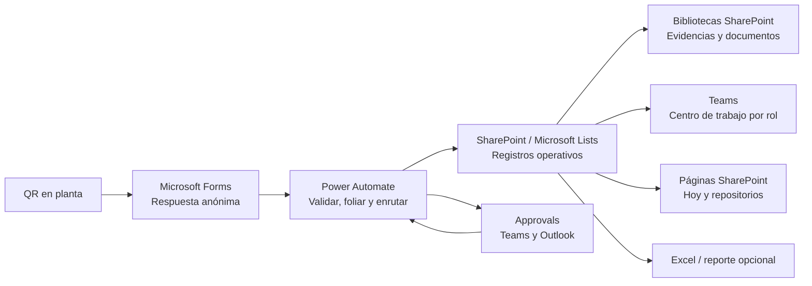

# 08. Experiencia PROpEx con M365, sin Power Apps como interfaz ni Dataverse como base de negocio

**Objetivo:** definir qué parte de PROpEx puede operar con Microsoft Forms, Microsoft Lists/SharePoint, Teams, Approvals, Outlook y Power Automate, sin construir Power Apps ni usar tablas personalizadas de Dataverse.

## 1. Conclusión ejecutiva

Sí es posible ofrecer una versión útil llamada **PROpEx M365 Lite**, especialmente como contingencia, piloto o etapa de transición. Puede resolver:

- captura pública de Ideas desde QR;
- enrutamiento básico por planta/área;
- aprobación de supervisor y validaciones departamentales;
- asignación, compromiso, recordatorios y seguimiento simple;
- archivos y evidencias en SharePoint;
- vistas `Hoy` por responsable dentro de Teams/SharePoint;
- repositorios, exportación a Excel y reportes básicos;
- sesiones y asistencia de Entrenamientos;
- comunicación por Teams y Outlook.

No ofrece una sustitución equivalente de todo PROpEx. Sin Power Apps/Dataverse quedan brechas de alta severidad en:

- seguridad por fila/campo y permisos que cambian con el estado;
- consistencia entre Ideas, validaciones, apoyos, Kaizen, GENBA, personas y movimientos;
- reglas transaccionales y concurrencia;
- experiencia móvil de piso;
- Kanban/Gantt sincronizados y portafolio integrado;
- captura anónima de evidencia;
- libro mayor inmutable y saldo seguro de ProbocaCoins;
- auditoría de negocio y trazabilidad de larga duración;
- identidad visual y navegación premium PROpEx.

La recomendación es usar M365 Lite para **Ideas de Mejora y seguimiento básico**, no declarar completada una “transferencia total” del sistema. Kaizen y GENBA pueden administrarse de forma simplificada; ProbocaCoins debe quedar fuera de operación financiera automatizada hasta disponer de una base con integridad transaccional.

> **Aclaración importante sobre “sin Dataverse”:** Teams/Power Automate Approvals requiere una base Dataverse y la provisiona automáticamente para guardar el servicio de aprobaciones. La solución puede no crear ni administrar tablas de negocio en Dataverse, pero no puede afirmar que Approvals funciona sin Dataverse en absoluto. Si el tenant prohíbe cualquier base Dataverse, se debe renunciar al conector Approvals y usar una alternativa de menor garantía con Lists/Teams.

## 2. Arquitectura M365 Lite

Principios:

1. SharePoint Lists conserva el estado maestro de la versión Lite.
2. Forms sólo recibe la solicitud; el Excel de respuestas no es la base de operación.
3. Power Automate crea y actualiza estados; no se acepta que usuarios editen columnas críticas directamente.
4. Teams es la puerta de entrada interna; SharePoint sigue aplicando los permisos reales.
5. Una vista filtrada mejora la experiencia, pero **no es una frontera de seguridad**.
6. Las bibliotecas conservan documentos; las listas conservan estado y metadatos.
7. Todo registro usa una clave de origen única para evitar duplicados al reintentar flujos.

## 3. Base documental y listas recomendadas

Sitio privado: `PROpEx Operación`.

### 3.1 Listas maestras

| Lista | Propósito | Claves y columnas críticas |
|---|---|---|
| `PROpEx Áreas` | Plantas, áreas, QR, responsable y rutas | `AreaCode` único, planta, área, supervisor, soportes, activo |
| `PROpEx Ideas` | Expediente maestro de Ideas | ID SharePoint, `Folio` único, `SourceResponseKey` único, estado, etapa, planta, área, solicitante, SQDCM, responsable, compromiso |
| `PROpEx Validaciones` | Una fila por supervisor/soporte/ronda | `ValidationKey` único, folio, tipo, asignado, estado, decisión, comentario, solicitado/respondido |
| `PROpEx Actividades` | Implementación, tareas Kaizen y acciones GENBA | `ActivityKey` único, tipo/folio padre, responsable, fecha, estado, bloqueo, verificación |
| `PROpEx Kaizen` | Proyecto simplificado | `KZN-###`, idea origen, líder, objetivo, línea base/meta/actual, fechas, ahorro, estado |
| `PROpEx Equipo Kaizen` | Miembros y rol del equipo | proyecto, persona, rol, reconocimiento |
| `PROpEx GENBA` | Recorrido simplificado | `GENBA-###`, área, fecha, coordinador, asistencia y estado |
| `PROpEx Asistencia GENBA` | Esperado/asistió por departamento | recorrido, departamento, esperado, asistió |
| `PROpEx Participantes` | Directorio operativo | número de empleado único, nombre, correo, área, activo |
| `PROpEx Entrenamientos` | Catálogo y sesiones | programa/sesión, fecha, planta, valor, instructor |
| `PROpEx Asistencia Entrenamiento` | Inscripción y finalización | sesión, participante, estado, valor reconocido |
| `PROpEx Movimientos Coins` | Registro de movimientos sólo si se acepta el riesgo | referencia única, participante, importe, origen, reverso, autor, fecha |
| `PROpEx Automatización` | Idempotencia y diagnóstico | clave de ejecución, flujo, intento, estado, correlación, error sanitizado |

No se recomienda una sola lista gigante con cientos de columnas. Tampoco se deben abusar columnas Lookup/Person: las vistas con demasiadas uniones son frágiles. Los folios y nombres de planta/área que deben filtrar o mostrar con frecuencia se materializan como texto y se indexan, aunque también exista un ID de referencia.

Índices mínimos por lista operativa:

- `Folio`/clave única;
- `Estado`;
- `Responsable` o `AsignadoA`;
- `FechaCompromiso`;
- `Planta` y `AreaCode`;
- `Modified`;
- `TipoPadre` y `ParentKey` en actividades/documentos.

SharePoint permite listas muy grandes, pero las consultas no diseñadas alcanzan el umbral de vista de 5,000 elementos. Todas las vistas productivas deben filtrar primero por una columna indexada y reducir el conjunto por debajo del umbral. Se archiva por año/planta sólo cuando la medición real justifique particionar; dividir anticipadamente complica la trazabilidad.

### 3.2 Bibliotecas

| Biblioteca | Contenido | Metadatos mínimos |
|---|---|---|
| `Evidencias PROpEx` | Antes, después, verificación y evidencias de actividad | folio, tipo de expediente, tipo de evidencia, planta, área, actividad, autor, fecha |
| `Charters Kaizen` | Charter y anexos de proyecto | folio Kaizen, versión, aprobado por, fecha |
| `GENBA` | Fotografías, minutas y comprobantes | folio GENBA, actividad, tipo, responsable |
| `Entrenamientos` | Listas, material y constancias | sesión, programa, planta, periodo |

Versionado, papelera, retención y auditoría se habilitan. No se crean enlaces “Cualquiera con el vínculo” para evidencias internas.

## 4. Teams como centro de trabajo

### 4.1 Estructura sugerida

Equipo privado `PROpEx Operación`:

- `General · Hoy`: página SharePoint `Hoy`, anuncios y guía rápida.
- `Supervisión`: vista de aprobaciones y compromisos de jefatura.
- `Calidad e Inocuidad`: validaciones y evidencias requeridas.
- `Seguridad Industrial`: validaciones, riesgos y bloqueos.
- `Mantenimiento`: factibilidad y actividades técnicas.
- `Mejora Continua`: control global, clasificación, implementación y repositorios.
- `Kaizen y GENBA`: portafolio simplificado y actividades.
- `Soporte PROpEx`: errores de automatización y datos incompletos, restringido.

Los canales estándar no dan seguridad distinta: todos los miembros del equipo pueden verlos. Para información sensible se usan listas con permisos propios, equipos separados o canales privados cuidadosamente gobernados. Un canal privado crea su propio sitio SharePoint y puede fragmentar documentos; no se usa como sustituto improvisado de seguridad por expediente.

### 4.2 Página `Hoy`

Una página moderna de SharePoint se agrega como pestaña de Teams. Contiene web parts de Lists con vistas dinámicas:

1. **Vencido y vence hoy:** responsable = `[Me]`, estado activo, fecha ≤ hoy.
2. **Mis decisiones:** validación asignada a `[Me]` y estado pendiente.
3. **Mis actividades:** Idea/Kaizen/GENBA asignada a `[Me]`.
4. **En seguimiento:** registros creados, liderados o coordinados por `[Me]`.
5. **Equipo:** sólo para supervisores, mediante una vista de su planta/área y permisos reales.
6. **Indicadores básicos:** conteos por estado y vínculos a Excel o reporte opcional.

No existe una bandeja unificada real entre varias listas sin desarrollo adicional. `Hoy` será una composición de web parts y vistas. Cada elemento debe mostrar folio, trabajo requerido, área, responsable, fecha, estado y siguiente paso.

### 4.3 Formato visual

JSON de formato de vista puede:

- aplicar acento Proboca `#EA0029`;
- mostrar iconos/etiquetas de estado;
- resaltar vencimiento;
- construir una fila compacta con folio, responsable y acción;
- ofrecer enlaces seguros al ítem/documento;
- dar vistas List, Gallery, Calendar o Board cuando el tipo lo permita.

El formato sólo cambia la presentación; no oculta datos a quien tiene permisos. Nunca se usa JSON, columnas ocultas o una vista privada para proteger información.

## 5. Captura pública y QR con Microsoft Forms

### 5.1 Aprovechamiento del formulario existente

El repositorio ya contiene el formulario de contingencia `Registro general de Ideas de Mejora | Proboca`, su enlace y QR para Apodaca/El Carmen. Ese activo puede convertirse en la entrada de M365 Lite, eliminando el uso manual de `Abrir en Excel` como operación diaria.

Power Automate procesa cada respuesta y:

1. obtiene detalle de Forms;
2. valida campos, planta y área contra `PROpEx Áreas`;
3. crea `SourceResponseKey = {FormId}:{ResponseId}` en `PROpEx Ideas`;
4. si la clave ya existe, finaliza como duplicado ignorado;
5. usa el ID del ítem para crear `IM-######` y lo guarda en `Folio` único;
6. resuelve supervisor y soportes;
7. registra validaciones pendientes;
8. envía confirmación si existe correo válido;
9. publica/solicita la aprobación correspondiente.

### 5.2 Un QR general frente a QR por área

**Opción recomendada para M365 Lite:** conservar un formulario general por planta o conjunto pequeño de plantas, con planta y área obligatorias. Reduce mantenimiento, pero permite error de selección.

**Opción de mayor precisión:** un Form de grupo por área o una copia por ruta. El área queda implícita en el FormId y el QR, pero administrar decenas de formularios, cambios y traducciones es costoso.

Microsoft Forms no debe tratarse como un portal con parámetros bloqueados. Un valor prellenado o una opción visible puede alterarse; la ruta siempre se valida al recibir la respuesta.

### 5.3 Restricciones del modo anónimo

`Cualquiera puede responder` permite usar el QR sin iniciar sesión y el enlace se puede reenviar. Sus límites para PROpEx son importantes:

- no se conoce la identidad real; nombre, correo y número de empleado son declarados;
- no hay seguridad de “una respuesta por persona” para anónimos;
- no hay un CAPTCHA/antiabuso personalizado equivalente a Power Pages;
- **la pregunta de carga de archivo no está disponible** cuando cualquiera puede responder;
- no puede mostrar dinámicamente el folio SharePoint generado después del envío;
- si el colaborador no proporciona correo, no recibirá el folio posterior;
- no permite consultar el estado del expediente de manera segura.

Por tanto, la captura anónima inicial no incluye fotografía. Alternativas:

1. supervisor o responsable adjunta la evidencia posteriormente desde SharePoint/Teams;
2. colaborador autenticado usa un segundo Form interno con carga de archivo y folio;
3. se acepta una descripción sin evidencia `Antes` para Ideas que no sean de seguridad;
4. no se usan enlaces anónimos de carga a SharePoint como solución por defecto, porque separan archivo/respuesta y amplían riesgo de abuso.

## 6. Aprobaciones, Teams y Outlook

### 6.1 Alternativa recomendada: conector Approvals

Las decisiones formales usan `Create an approval`/`Start and wait for an approval` según duración. El aprobador responde desde:

- correo accionable estándar de Outlook;
- tarjeta de aprobación en Teams;
- aplicación Approvals de Teams;
- centro de acciones de Power Automate.

La solicitud presenta:

- folio y etapa;
- problema, propuesta y beneficio;
- planta/área y solicitante;
- impactos SQDCM y apoyos;
- evidencia disponible mediante vínculo autorizado;
- fecha objetivo;
- opciones `Aprobar`, `Rechazar` y, cuando se requiera, respuesta personalizada `Solicitar información`;
- comentario obligatorio para rechazo o solicitud de información.

El flujo guarda en `PROpEx Validaciones`: Approval ID, ronda, asignado, solicitado, vencimiento, resultado, respondido por, fecha y comentario. Antes de aplicar la respuesta relee el estado del ítem y la ronda; una respuesta antigua no modifica una ronda nueva.

Una ejecución de flujo dura como máximo 30 días, incluidas esperas de aprobación. Los SLA PROpEx deben resolverse en días. Al acercarse al límite, la aprobación se cancela/vence, queda auditada y se crea una nueva ronda; no se deja un flujo esperando indefinidamente.

### 6.2 Outlook: qué sí y qué no

**Sí:** usar el correo accionable que genera el conector estándar Approvals. Microsoft mantiene el remitente y la tarjeta; el usuario puede aprobar/rechazar en Outlook cuando su tipo de cuenta/cliente lo soporte.

**No recomendado:** construir tarjetas Adaptive Card propias dentro de un correo `Send an email (V2)`. Outlook Actionable Messages requiere propiedades y registro de origen, usa acciones HTTP y compatibilidad específica; sale del alcance simple de M365 Lite.

`Send email with options` tampoco debe ser la fuente de una decisión regulada: tiene diferencias de renderizado/identidad y no ofrece el historial consistente de Approvals. Puede servir para una encuesta no vinculante.

Invitados no pueden actuar desde el correo accionable de Approvals; deben abrir Power Automate. PROpEx debe usar cuentas internas Entra para supervisores y soportes.

### 6.3 Tarjetas Adaptive Card en Teams

Se usan para interacciones breves no financieras:

- confirmar recepción de una actividad;
- informar avance y comentario;
- seleccionar causa de bloqueo;
- confirmar asistencia GENBA;
- abrir el expediente.

Una tarjeta con “wait for a response” se puede enviar una sola vez y mantiene abierta una ejecución; no sustituye una aprobación de semanas ni un formulario complejo. Después de responder se reemplaza por una tarjeta de confirmación para impedir doble acción.

### 6.4 Escenario estricto: cero Dataverse, incluso para Approvals

Si TI prohíbe que Approvals provisione Dataverse:

- no usar la aplicación/conector Approvals;
- enviar una tarjeta Teams a un usuario y esperar respuesta, con timeout corto;
- o conceder acceso al ítem y pedir la decisión en un Form interno autenticado;
- registrar decisión, actor y hora en `PROpEx Validaciones`;
- aplicar recordatorios y reexpedición desde un flujo programado.

Esta opción pierde bandeja de Approvals, historial nativo, reasignación y correo accionable confiable. Además, una tarjeta en espera sigue limitada por la duración del flujo. Sólo es aceptable para un piloto con SLA corto y soporte manual.

## 7. Vistas y trabajo por rol

| Rol | Entrada | Vistas/acciones M365 Lite | Seguridad requerida |
|---|---|---|---|
| **Colaborador sin cuenta** | QR de Forms | Registrar Idea y recibir correo si lo proporciona | Sin acceso a Lists/SharePoint |
| **Colaborador con cuenta** | Teams/SharePoint móvil | `Mis ideas`, `Mis actividades`, Form interno de información/evidencia, saldo sólo lectura si se habilita | Lectura sólo de lo propio/asignado; preferir ítems compartidos o lista separada |
| **Supervisor** | `General · Hoy` y Approvals | `Mis decisiones`, equipo, vencidas, evidencias | Grupo Entra por planta/área; permiso a ítems necesarios, no a toda la lista global |
| **Calidad** | canal/pestaña Calidad | validaciones asignadas, historial y evidencias pertinentes | Grupo `PROpEx-Calidad`; datos mínimos de expediente |
| **Seguridad** | canal/pestaña Seguridad | validaciones, riesgos críticos y bloqueos | Grupo `PROpEx-Seguridad`; acceso controlado a evidencias |
| **Mantenimiento** | canal/pestaña Mantenimiento | factibilidad, compromisos y acciones técnicas | Grupo `PROpEx-Mantenimiento` y asignación |
| **Mejora Continua** | página `Hoy` global | clasificación, asignación, implementación, repositorios, errores | Control sobre listas operativas, no administración de SharePoint completa |
| **Administración** | sitio/listas | estructura, permisos, flujos, auditoría, corrección controlada | Propietarios del sitio/grupo de soporte reducido |
| **Dirección** | página ejecutiva/Excel o BI opcional | indicadores agregados y repositorios de lectura | Grupo de lectura; sin acceso a datos personales innecesarios |

Los filtros `[Me]`, `[Today]`, planta y estado permiten vistas útiles. No impiden que un usuario navegue a otra vista o consulte otro ítem si el permiso subyacente se lo permite.

## 8. Estrategia de seguridad SharePoint

### 8.1 Opción preferida

- `PROpEx Ideas` maestra: sólo Mejora Continua, administración y cuenta de automatización tienen edición.
- Supervisores/soportes reciben la decisión mediante Approvals y acceso de lectura al ítem/documentos estrictamente necesarios.
- Actividades asignadas se exponen en una lista separada con datos mínimos y permisos por audiencia.
- Repositorios de Dirección usan vistas/listas de publicación sin datos personales sensibles.
- Columnas críticas (`Estado`, `Folio`, `Saldo`, `Importe`, `ApprovalId`, claves) sólo las modifica la cuenta de automatización o un grupo restringido.

### 8.2 Riesgo de permisos por ítem

Compartir cada Idea con su supervisor/soportes rompe herencia y crea un ámbito de permiso único. SharePoint admite hasta 50,000 ámbitos únicos por lista/biblioteca, pero este patrón incrementa complejidad y puede degradar operación mucho antes de una experiencia empresarial cómoda.

Mitigaciones:

- no crear un ámbito nuevo si el grupo de área ya tiene acceso;
- quitar permisos de rondas/responsables anteriores;
- particionar por planta/año sólo con criterio de volumen y gobierno;
- vigilar conteo de ámbitos y herencias rotas;
- no usar permisos únicos por archivo si la carpeta/expediente ya puede asegurar el conjunto;
- ejecutar pruebas negativas con URL directa, búsqueda, exportación y vínculo reenviado.

### 8.3 Lo que no existe de forma nativa equivalente

- seguridad por columna como Dataverse Field Security;
- reglas por estado para ocultar sólo un campo;
- ownership y equipos con cascada de relaciones;
- privilegios transaccionales por acción de negocio;
- prevención absoluta de compartir si el nivel de permiso conserva `Manage Permissions`.

La vista, el formato JSON, una columna oculta y un canal de Teams **no son controles de acceso**.

## 9. Matriz función actual → alternativa M365 Lite

| Función PROpEx actual | Alternativa sin Power Apps/Dataverse de negocio | Cobertura | Limitación principal |
|---|---|---|---|
| Inicio de sesión y roles | Entra ID + grupos M365/SharePoint/Teams | **Aceptable** | Menor granularidad por fila/campo |
| Captura pública QR | Forms `Cualquiera puede responder` | **Aceptable parcial** | Sin identidad, CAPTCHA personalizado, folio inmediato ni archivo |
| QR por planta/área | Un Form general o Forms por área | **Parcial** | General permite selección errónea; copias elevan mantenimiento |
| Evidencia `Antes` anónima | Captura posterior por responsable/Form interno | **Brecha alta** | Forms anónimo no permite carga de archivo |
| Folio `IM-######` | ID de SharePoint formateado por flujo | **Aceptable** | Aparece después del flujo, no en la pantalla final de Forms |
| Prevención de doble envío | `FormId:ResponseId` en columna única | **Aceptable técnica** | No impide dos respuestas humanas distintas con mismo contenido |
| Ruta jerárquica | Lista Áreas + condiciones Power Automate | **Aceptable parcial** | Mantener jerarquías profundas en Lists es frágil |
| `Hoy` universal | Página SharePoint + varias vistas `[Me]` | **Parcial** | No existe tabla unificada ni personalización premium |
| Bandeja supervisor | Approvals + vista asignada | **Aceptable** | Approvals usa Dataverse internamente y flujo ≤30 días |
| Solicitar información | Respuesta personalizada + correo/Form interno | **Parcial** | Conversación y reanudación por ronda requieren mucha automatización |
| Validaciones Calidad/Seguridad/Mantenimiento | Approvals paralelas + lista Validaciones | **Aceptable parcial** | Concurrencia, rondas y cancelación son complejas |
| Apoyos organizacionales dinámicos | Filas adicionales en Validaciones/Actividades | **Parcial** | Permisos y sincronización crecen por cada apoyo |
| Clasificación Mejora Continua | Edición controlada/List form interno | **Aceptable** | Sin formulario por estado ni campos protegidos finamente |
| Implementación y compromisos | Lista Actividades + Calendar/Board | **Aceptable parcial** | Relación y resumen se calculan por flujos, no transacción |
| Evidencias internas | Biblioteca SharePoint con metadatos | **Aceptable** | Permisos deben sincronizarse con el expediente |
| Detalle 360 de Idea | Página/ítem Lists + vínculos a listas relacionadas | **Parcial** | Navegación fragmentada, sin formulario compuesto |
| Comentarios y seguidores | Comentarios Lists, @mentions, Teams | **Parcial** | Difícil construir bitácora única y notificaciones idempotentes |
| Kanban Ideas | Board view de Lists o Planner opcional | **Parcial** | Mover tarjeta no debe saltar reglas de estado; Planner duplicaría estado |
| Compromisos vencidos | Vista indexada + flujo diario | **Aceptable** | Recordatorios requieren mantenimiento y cuenta de servicio |
| Repositorio Ideas | Vista filtrada por estados terminales | **Aceptable** | Mismos permisos que lista; exportación puede exponer de más |
| Alta/carpeta Kaizen | Lista Kaizen + biblioteca Charter + actividades | **Parcial** | Experiencia repartida entre varias superficies |
| Equipo Kaizen | Lista de miembros | **Parcial** | No hay seguridad/relación nativa equivalente |
| Línea base/meta/actual | Columnas numéricas y Excel/BI opcional | **Aceptable básica** | Sin controles ejecutivos integrados ni validación compleja |
| Kanban Kaizen | Board por estado | **Parcial** | Proyecto/actividades no se ven juntos con profundidad |
| Gantt Kaizen | Excel, Planner/Project opcional o Calendar view | **Brecha media-alta** | No hay Gantt sincronizado estándar en Lists con la fidelidad actual |
| Ahorro estimado/real | Columnas y reporte | **Parcial** | Sin validación financiera/seguridad de columna fuerte |
| Alta GENBA en piso | Lists form/Forms interno + Teams móvil | **Parcial** | Más toques, sin captura compuesta ni offline |
| Asistencia GENBA | Form interno/tarjeta Teams → lista Asistencia | **Aceptable básica** | Confirmación masiva menos eficiente |
| Actividades GENBA ilimitadas | Lista Actividades relacionada | **Aceptable parcial** | Alta repetitiva y contexto fragmentado en móvil |
| Fotografía GENBA | Carga autenticada a SharePoint | **Aceptable en línea** | No anónimo ni offline; permisos/documentos requieren cuidado |
| Combinar duplicados GENBA | Flujo y referencia `MergedInto` | **Parcial/riesgosa** | No hay operación atómica entre filas/documentos |
| Convertir GENBA a Kaizen | Flujo crea proyecto/actividades y liga claves | **Parcial/riesgosa** | Puede dejar relación incompleta si falla a mitad |
| Libro mayor ProbocaCoins | Lista append-only + referencia única | **No aconsejable para producción** | Edit/delete, concurrencia y balance negativo no son transaccionales |
| Saldo por participante | Suma agregada por flujo/Excel | **No aconsejable como saldo oficial** | Puede quedar desactualizado o duplicarse |
| Reverso de duplicado Coins | Movimiento compensatorio por flujo | **Parcial/riesgosa** | Difícil garantizar un solo reverso concurrente |
| Entrenamientos y sesiones | Lists + Forms interno de asistencia | **Aceptable** | Reconocimiento Coins conserva el riesgo del ledger |
| Notificaciones | Outlook/Teams + reglas/Power Automate | **Aceptable** | Límites, throttling y errores requieren bitácora/reintento |
| Auditoría | Version history + lista de auditoría de flujo | **Parcial** | Historial técnico no equivale a auditoría de negocio inmutable |
| Exportaciones | Export to Excel / archivo programado | **Aceptable parcial** | Copia fuera del control operativo y riesgo de datos personales |
| Dashboard operativo | SharePoint page + vistas/conteos | **Básico** | Sin embudo, SLA, antigüedad y drill-through integrados |
| Dashboard ejecutivo | Excel Pivot; Power BI opcional si existe licencia | **Parcial** | Power BI no es una herramienta M365 base universal |
| Configuración organizacional | Listas Áreas, Personas, Reglas | **Aceptable pequeña escala** | Sin integridad jerárquica ni cascada robusta |
| Control de datos/borrado | Permisos propietarios + retención | **Parcial** | Las listas permiten acciones directas si el permiso es demasiado amplio |

## 10. ProbocaCoins: límite no negociable

SharePoint puede registrar filas, imponer una columna única `Reference` y conservar versiones, pero no ofrece una transacción que simultáneamente:

1. valide que la referencia no existe;
2. calcule saldo vigente;
3. impida un canje que deje saldo negativo;
4. inserte el movimiento;
5. enlace el origen/reverso;
6. confirme todo o revierta todo ante error.

Dos flujos concurrentes pueden leer el mismo saldo y autorizar dos canjes. Serializar toda la lista reduce el riesgo, pero no convierte Lists en un ledger transaccional. La recomendación es:

- migrar el historial a lectura;
- impedir canjes automáticos en M365 Lite;
- registrar reconocimientos provisionales para conciliación manual;
- mantener el saldo oficial en el sistema PROpEx actual hasta Dataverse u otra base transaccional;
- nunca permitir edición/eliminación directa de movimientos confirmados.

## 11. Experiencia móvil y de piso

La aplicación móvil nativa de Microsoft Lists fue retirada en noviembre de 2025. La experiencia disponible es:

- navegador móvil de Lists/SharePoint;
- pestañas de SharePoint/Lists dentro de Teams móvil;
- Approvals/Teams para decisiones;
- Forms en navegador para captura.

Implicaciones:

- más navegación y cambios de contexto que en una app dedicada;
- sesiones de autenticación pueden interrumpir trabajo en piso;
- no hay offline confiable;
- cámara/archivo funciona para usuarios autenticados cuando el formulario/lista lo admite;
- una tabla ancha resulta poco operable; las vistas móviles muestran sólo folio, tarea, estado, responsable y fecha;
- Board/Gallery deben tener alternativa List compacta;
- los vínculos se prueban desde QR, Teams móvil, Outlook móvil y navegador corporativo real.

Pruebas mínimas:

- 320 × 568, 360 × 800, 390 × 844 y 412 × 915;
- Android/iOS corporativos y Teams/Outlook vigentes;
- toque de 44 × 44 px, texto al 200 %, contraste y lector;
- captura con red lenta, reintento y doble toque;
- cinco actividades GENBA consecutivas;
- evidencia desde cámara;
- aprobación desde Teams y Outlook;
- sesión expirada y permiso revocado.

## 12. Identidad, accesibilidad y estados

M365 permite aproximar la identidad, no replicar la interfaz actual:

- tema y logotipo Proboca en SharePoint/Forms cuando el tenant lo permita;
- rojo `#EA0029` para marca/selección, no como único indicador de rechazo;
- vistas Lists formateadas con blanco, grafito y grises;
- colores departamentales como acento secundario;
- icono + texto + fecha para estado y urgencia;
- tarjetas Teams con bloques simples y una acción primaria;
- lenguaje breve, sin exponer IDs técnicos al usuario.

Estados obligatorios:

| Estado | Comportamiento |
|---|---|
| **Sin pendientes** | “No tienes trabajo pendiente” y vínculo a seguimientos; no una lista vacía sin explicación |
| **Carga** | Mensaje de consulta; no permitir doble acción |
| **Error de flujo** | El registro conserva estado anterior, correlación y cola de soporte; nunca aparenta cierre |
| **Aprobación vencida** | Estado visible, ronda cerrada y acción de reexpedir |
| **Datos incompletos** | Vista de calidad de datos y responsable de corrección |
| **Archivo fallido** | Error por archivo, reintento y registro relacionado sin marcar evidencia completa |
| **Sin permiso** | Mensaje de acceso; no redirigir a una vista global ni pedir compartir manualmente |

Se conserva accesibilidad nativa y se prueba cualquier JSON/Adaptive Card: foco, etiquetas, contraste, lectura lineal, zoom, modo oscuro y texto largo. No se oculta texto esencial dentro de una imagen.

## 13. Automatización y controles técnicos

Cada flujo debe tener:

- propietario de servicio y copropietario de grupo;
- conexiones/referencias documentadas;
- clave idempotente única en SharePoint;
- scopes `Try`, `Catch`, `Finally`;
- reintento sólo de fallas transitorias;
- registro de correlación, intento y error sanitizado;
- condición para ignorar actualizaciones hechas por el propio flujo;
- comprobación de estado/ronda antes de aplicar respuesta;
- paginación e índices en consultas;
- alerta cuando la cola queda envejecida;
- DLP que mantenga Forms, SharePoint, Teams y Outlook como conectores empresariales.

Patrones específicos:

- Folio: usar ID de ítem, no “contar elementos + 1”.
- Unicidad: columna SharePoint con valores únicos; `Get items` previo no es garantía.
- Aprobación: guardar `ApprovalId` y ronda en la fila de validación.
- Estado: aplicar sólo transiciones permitidas y conservar versión anterior en auditoría.
- Documento: guardar folio/ParentKey en metadatos, no inferir relación sólo por nombre de carpeta.
- Recordatorio: clave `{ParentKey}:{DueDate}:{Threshold}:{Recipient}` para no enviar duplicados.
- Conversión: crear un registro técnico de ejecución y marcar `Completed` sólo cuando todas las filas/vínculos existan; aun así no es una transacción real.

## 14. Riesgos por severidad

| Severidad | Riesgo | Consecuencia | Tratamiento |
|---|---|---|---|
| **Crítica** | Usar Lists como saldo oficial de ProbocaCoins | Doble canje, saldo incorrecto o edición no autorizada | Mantener ledger oficial fuera de M365 Lite |
| **Alta** | Confundir una vista `[Me]` con seguridad | Exposición de Ideas/personas/evidencias | Permisos reales, pruebas con URL directa y grupos Entra |
| **Alta** | Captura anónima sin archivo/identidad | Evidencia faltante y suplantación | Evidencia posterior y validación por supervisor |
| **Alta** | Flujos suspendidos >30 días | Aprobación expira sin aplicar respuesta | SLA corto, vencimiento/reexpedición y monitor diario |
| **Alta** | Conversión/relaciones por varios pasos | Huérfanos Idea–Kaizen–GENBA | Ejecución idempotente, conciliación y soporte; migrar a base relacional |
| **Alta** | Permisos únicos por cada ítem | Complejidad, acceso residual y límite de ámbitos | Grupos por área, mínimo sharing y monitoreo |
| **Media** | Listas >5,000 con vistas no indexadas | Errores/consultas bloqueadas | Índices, filtros selectivos, paginación y pruebas de volumen |
| **Media** | Teams/SharePoint fragmentan la navegación | Más tiempo y capacitación | Página Hoy, pestañas estables y enlaces directos |
| **Media** | Outlook/Teams difieren por cliente | Botón no visible o apertura externa | Usar Approvals estándar y probar matriz de clientes |
| **Media** | Aplicación Lists móvil retirada | Experiencia de piso más débil | Teams/navegador móvil; no prometer app nativa/offline |
| **Baja** | Branding limitado | Menor percepción premium | Tema, logo y formato coherente; priorizar claridad |

## 15. Alcance de piloto recomendado

### Incluir

- formulario general ya existente y QR;
- Ideas desde captura hasta cierre simple;
- supervisor + Calidad/Seguridad/Mantenimiento;
- solicitud de información por una ronda controlada;
- clasificación y responsable de implementación;
- evidencias internas en SharePoint;
- vistas `Hoy`, vencidas y repositorio;
- notificaciones, recordatorios y bitácora técnica;
- Entrenamientos sin acreditar saldo oficial automáticamente.

### Simplificar

- Kaizen como proyecto + equipo + actividades + documentos, sin Gantt avanzado;
- GENBA como recorrido + asistencia + actividades, sin experiencia offline ni mapa de calor nativo;
- indicadores mediante Excel/SharePoint; Power BI sólo si ya está licenciado y gobernado.

### Excluir del saldo oficial

- canjes ProbocaCoins;
- ajustes concurrentes;
- cierre financiero automático;
- reversos sin conciliación;
- cualquier regla que requiera todo-o-nada entre varios registros.

## 16. Criterios para abandonar M365 Lite y pasar a Power Apps/Dataverse

La migración completa se vuelve necesaria cuando ocurra cualquiera de estos puntos:

- un usuario debe ver campos diferentes del mismo registro según rol;
- el permiso cambia frecuentemente por estado/asignación;
- se requieren transacciones, saldo o unicidad entre varias tablas;
- Kaizen/GENBA necesita relación, cascada, conversión y cierre sin huérfanos;
- el volumen obliga a demasiados permisos únicos o vistas frágiles;
- piso exige app móvil dedicada, cámara guiada u offline;
- Dirección requiere trazabilidad histórica de etapas/SLA y drill-through confiable;
- las excepciones/manualidades ocupan más tiempo que operar el proceso;
- se necesita paridad real con `Hoy`, Kanban, Gantt y expediente 360.

## 17. Criterios de aceptación de M365 Lite

- La respuesta Forms crea una sola Idea con folio único aun si el flujo reintenta.
- QR inválido/área inactiva no produce una Idea enrutada silenciosamente.
- Supervisor y soportes reciben sólo las decisiones que les corresponden.
- Una respuesta de ronda anterior no cambia el estado actual.
- Las vistas por rol muestran responsable, fecha y siguiente acción.
- Un usuario no autorizado falla al abrir URL directa, búsqueda, documento y exportación.
- Evidencias internas conservan versión, folio y tipo.
- Vistas con volumen superior a 5,000 elementos siguen funcionando por índices/filtros.
- La aprobación se reexpide antes de 30 días y el caso original queda cerrado.
- Teams/Outlook/navegador móvil pasan la matriz real de dispositivos.
- El historial PROpEx actual permanece disponible y ProbocaCoins se concilia fuera de Lists.

## 18. Recomendación final

La experiencia viable sin Power Apps/Dataverse de negocio es un **centro de trabajo M365 distribuido**:

- Forms para entrada;
- Lists para expedientes simples;
- SharePoint para documentos y páginas;
- Teams para navegación y acción diaria;
- Approvals/Outlook para decisiones;
- Power Automate para conexión y seguimiento.

Es adecuada como contingencia y puede mejorar de inmediato el formulario general existente. No alcanza la profundidad del sistema PROpEx actual ni la seguridad/integridad de la arquitectura Power Platform propuesta. Debe comunicarse como **M365 Lite**, con alcance y exclusiones firmados, y conservar la aplicación vigente para ProbocaCoins, relaciones complejas y operación que no admita inconsistencias.

## 19. Referencias oficiales

- [Forms: recopilar respuestas, acceso anónimo y QR](https://support.microsoft.com/en-US/Forms/send-a-form-and-collect-responses)
- [Forms: la carga de archivos requiere respondedores internos](https://support.microsoft.com/en-us/forms/add-questions-that-allow-for-file-uploads-in-microsoft-forms)
- [Power Automate Approvals y su requisito de Dataverse](https://learn.microsoft.com/en-us/power-automate/get-started-approvals)
- [Conector estándar Approvals y correo accionable](https://learn.microsoft.com/en-us/connectors/approvals/)
- [Límite de 30 días por ejecución de flujo](https://learn.microsoft.com/en-us/power-automate/limits-and-config)
- [Adaptive Cards mediante Power Automate y Teams](https://learn.microsoft.com/en-us/power-automate/create-adaptive-cards)
- [Outlook Actionable Messages con Adaptive Cards](https://learn.microsoft.com/en-us/outlook/actionable-messages/adaptive-card)
- [Vistas dinámicas de SharePoint con `[Me]` y `[Today]`](https://support.microsoft.com/en-US/SharePoint/data-and-lists/use-filtering-to-modify-a-sharepoint-view)
- [Formato JSON de vistas: sólo presentación](https://learn.microsoft.com/en-us/sharepoint/dev/declarative-customization/view-formatting)
- [Límites de SharePoint y ámbitos de permisos únicos](https://learn.microsoft.com/en-us/office365/servicedescriptions/sharepoint-online-service-description/sharepoint-online-limits)
- [Umbral de vista de 5,000 elementos](https://learn.microsoft.com/en-us/troubleshoot/sharepoint/lists-and-libraries/items-exceeds-list-view-threshold)
- [Retiro de las aplicaciones móviles Microsoft Lists](https://support.microsoft.com/en-us/office/microsoft-lists-mobile-apps-retirement-f8645669-d5d1-401f-afc5-295e529ddaaf)

